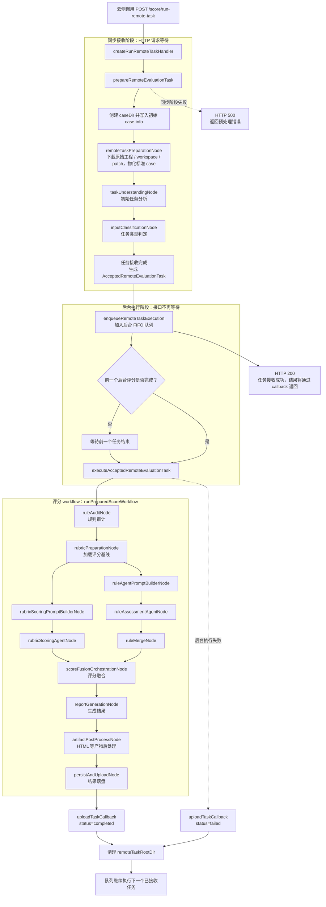

# hmos-score-agent

基于 LangGraph + TypeScript 的 HarmonyOS 代码评分服务骨架。  
目标是把“原始工程 + prompt + 生成工程 + patch”作为单条用例输入，执行统一评分工作流，输出结构化 `result.json` 与可视化 `report.html`。

## 1. 工程如何运作

### 核心流程

当前工作流在 `src/workflow/scoreWorkflow.ts`，按固定顺序串联节点：

1. `taskUnderstandingNode`：任务理解（显式/上下文/隐式约束）
2. `inputClassificationNode`：任务分类（`full_generation` / `continuation` / `bug_fix`）
3. `featureExtractionNode`：代码特征抽取（基础/结构/语义/变更）
4. `ruleAuditNode`：规则审计，产出确定性规则结果、Agent 辅助候选规则、证据索引和违规项
5. `rubricPreparationNode`：按任务类型加载 rubric，并生成评分快照
6. `agentPromptBuilderNode`：基于任务信息、rubric、规则结果组装 Agent 判定 prompt 与 payload
7. `agentAssistedRuleNode`：调用 Agent 对候选规则做辅助判定；无候选或未配置 client 时会跳过
8. `ruleMergeNode`：合并确定性规则结果与 Agent 判定结果；Agent 不可用时回退为“待人工复核”
9. `scoringOrchestrationNode`：基于合并后的规则审计结果、rubric、特征与约束执行评分编排
10. `reportGenerationNode`：生成并校验结构化 `result.json`
11. `artifactPostProcessNode`：基于 `result.json` 渲染 `report.html`
12. `persistAndUploadNode`：写入输入/中间产物/输出文件

### 输入与输出

- 默认输入目录：`cases/` 下按名称排序后的首个用例目录
- 用例输入结构（骨架约定）：
  - `input.txt`：prompt
  - `original/`：原始工程
  - `workspace/`：生成工程
  - `diff/changes.patch`：patch（可选）

运行后会在本地生成：

- `.local-cases/<caseId>/inputs/`
- `.local-cases/<caseId>/intermediate/`
  - `constraint-summary.json`
  - `feature-extraction.json`
  - `rule-audit.json`
- `.local-cases/<caseId>/outputs/`
  - `result.json`
  - `report.html`

## 2. 快速开始

### 环境要求

- Node.js 18+（建议 20+）
- npm 9+

### 安装依赖

```bash
npm install
```

### 环境变量

先复制模板：

```bash
cp .env.example .env
```

关键变量：

- `LOCAL_CASE_ROOT`：本地产物目录，默认 `.local-cases`
- `DEFAULT_REFERENCE_ROOT`：评分参考目录，默认 `references/scoring`
- `MODEL_PROVIDER_BASE_URL`：兼容 chat completions 的模型服务地址
- `MODEL_PROVIDER_API_KEY`：模型服务鉴权密钥
- `MODEL_PROVIDER_MODEL`：模型名称，默认 `gpt-5.4`

默认参考资源：

- `references/scoring/rubric.yaml`
- `references/scoring/report_result_schema.json`

评分规则:

-  `src/rules/packs/`。

## 3. 本地调试

### 3.1 CLI 调试（推荐）

直接跑默认用例：

```bash
npm run dev:cli -- --case cases/bug_fix_001
```

成功后终端会打印用例产物目录，例如：

```text
评分完成，结果目录：.../.local-cases/20260416T112233_bug_fix_a1b2c3d4
```

### 3.2 API 调试

启动服务：

```bash
npm run dev:api
```

健康检查：

```bash
curl http://localhost:3000/health
```

触发评分：

```bash
curl -X POST http://localhost:3000/score/run \
  -H "Content-Type: application/json" \
  -d '{"casePath":"cases/bug_fix_001"}'
```

触发云端直推远程评分任务：

```json
{
  "taskId": 4,
  "testCase": {
    "id": 8,
    "name": "123222",
    "type": "requirement",
    "description": "2222222",
    "input": "222222222",
    "expectedOutput": "2222222211",
    "fileUrl": "https://example.com/original.json"
  },
  "executionResult": {
    "isBuildSuccess": true,
    "outputCodeUrl": "https://example.com/workspace.json",
    "diffFileUrl": "https://example.com/changes.patch"
  },
  "token": "后续 callback 鉴权使用",
  "callback": "http://localhost:3000/api/evaluation-tasks/callback"
}
```

调用方式：

```bash
curl -X POST http://localhost:3000/score/run-remote-task \
  -H "Content-Type: application/json" \
  -d '{
    "taskId": 4,
    "testCase": {
      "id": 8,
      "name": "123222",
      "type": "requirement",
      "description": "2222222",
      "input": "222222222",
      "expectedOutput": "2222222211",
      "fileUrl": "https://example.com/original.json"
    },
    "executionResult": {
      "isBuildSuccess": true,
      "outputCodeUrl": "https://example.com/workspace.json",
      "diffFileUrl": "https://example.com/changes.patch"
    },
    "token": "后续 callback 鉴权使用",
    "callback": "http://localhost:3000/api/evaluation-tasks/callback"
  }'
```

调用成功后，接口会在完成以下同步阶段后立即返回：

- 远端目录清单 / patch 下载
- case 物化
- 初始任务分析
- 任务类型判定

当前云侧任务 workflow：



成功响应示例：

```json
{
  "success": true,
  "taskId": 4,
  "caseDir": "/abs/path/.local-cases/full_generation_xxx",
  "message": "任务接收成功，结果将通过 callback 返回"
}
```

注意：

- 该响应只表示任务已被本地服务接收，尚不表示最终评分完成。
- 最终评分结果仍通过 `callback` 异步回传。
- 重复调用接口时，已接收任务的后台评分阶段会按接收顺序排队执行，避免多个云侧用例任务并发评分。
- 如果预处理阶段失败，例如远端目录清单下载失败、patch 下载失败或初始任务分析失败，接口会直接返回 `500`。

当前远程资源格式约定：

- `testCase.fileUrl`：下载原始工程目录清单 JSON
- `executionResult.outputCodeUrl`：下载待评分工程目录清单 JSON
- `executionResult.diffFileUrl`：下载 patch 文本，可选
- 目录清单 JSON 结构为：

```json
{
  "files": [
    {
      "path": "entry/src/main/ets/pages/Index.ets",
      "content": "@Entry\n@Component\nstruct Index {}"
    }
  ]
}
```

异步评分执行完成后，服务会向 `callback` 发起 `POST` 回传，header 使用 `token: <token>`，请求体格式如下：

```json
{
  "taskId": 4,
  "status": "completed",
  "totalScore": 85,
  "maxScore": 100,
  "resultData": {
    "basic_info": {
      "rubric_version": "v1"
    }
  }
}
```

## 4. 常用命令

- `npm run build`：TypeScript 编译检查
- `npm run dev:cli -- --case <path>`：命令行运行单用例
- `npm run dev:api`：本地 HTTP 服务调试
- `npm run launch:score`：交互式填写 `baseURL` / `apiKey`，写入 `.env` 后运行评分流程
- `npm run score -- --case <path>`：与 `dev:cli` 等价

### 交互式启动评分

执行：

```bash
npm run launch:score
```

如需指定自定义用例目录：

```bash
npm run launch:score -- --case examples/my-case
```

脚本会：

1. 在终端里询问 `MODEL_PROVIDER_BASE_URL` 和 `MODEL_PROVIDER_API_KEY`
2. 将输入结果写入项目根目录 `.env`
3. 读取 `--case` 指定目录；未指定时默认读取 `cases/` 下按名称排序后的首个用例目录
4. 启动评分流程
5. 在 `.local-cases/` 下创建 `时间_task_type_唯一id` 目录并写入产物
6. 将初始 prompt 落盘到 `inputs/prompt.txt`
7. 将用例元信息落盘到 `inputs/case-info.json`
8. 将关键运行日志追加写入 `logs/run.log`

### Patch 生成说明

`cases/<caseId>/workspace` 应作为主仓库中的普通目录使用，不依赖独立 Git 仓库。评分主流程会在运行期基于 `original/` 和 `workspace/` 目录差异生成有效 patch，底层等价于在用例目录执行：

```bash
git diff --no-index -- original workspace > diff/changes.patch
```

### Patch 与评测过滤

- Patch 生成逻辑会分别读取 `original/.gitignore` 和 `workspace/.gitignore`
- 规则评测采集文件时，也会按对应目录根级 `.gitignore` 过滤
- 当前仅支持根级 `.gitignore` 的常见规则，例如目录模式、文件模式和简单 `*` 通配
- 如果 `.gitignore` 缺失或不可读，会回退到内置的保底忽略项

## 5. 代码结构速览

```text
hmos-score-agent/
  README.md                         # 使用说明、调试入口与代码结构速览
  package.json                      # npm 脚本、运行时依赖与开发依赖声明
  tsconfig.json                     # TypeScript 编译配置
  eslint.config.mjs                 # ESLint 规则配置
  .env.example                      # 本地环境变量模板
  references/
    scoring/                        # 评分 rubrics、结果 schema 与评分说明文档
      rubric.yaml                   # 不同任务类型的维度/指标/分值配置
      report_result_schema.json     # result.json 输出结构校验 schema
      *_rubric.md                   # full_generation / continuation / bug_fix 评分细则
    rules/                          # 内置静态规则包的 YAML 导出结果
  src/
    index.ts                        # Express API 入口，注册本地评分与远端任务接口
    cli.ts                          # CLI 入口，按 --case 或默认用例执行评分
    service.ts                      # 评分服务编排层，连接用例加载、工作流与回调上传
    config.ts                       # 环境变量读取与默认配置归一化
    types.ts                        # 远端任务、用例、评分、报告等共享类型定义
    agent/                          # 模型客户端、case-aware 工具协议与 agent runner
      agentClient.ts                # 兼容 chat completions 的模型请求封装
      caseTools.ts                  # 面向模型的文件读取/目录查看等用例工具实现
      rubricScoring.ts              # rubric 评分 agent 的结构化结果处理
      taskUnderstanding.ts          # 任务理解相关模型调用与结果归一化
    io/                             # 文件、网络、日志、patch 与产物读写工具
      caseLoader.ts                 # 从本地 case 目录加载 input/original/workspace/diff
      artifactStore.ts              # 管理 .local-cases 下 inputs/intermediate/outputs/logs
      downloader.ts                 # 下载远端目录清单、zip 或文本资源
      uploader.ts                   # 向回调地址上传最终评分结果
      patchGenerator.ts             # 基于 original/workspace 生成 gitignore-aware patch
      caseLogger.ts                 # 单用例日志写入封装
    workflow/                       # LangGraph 评分工作流定义与流式观测
      scoreWorkflow.ts              # 组装评分图节点、边和执行逻辑
      state.ts                      # 工作流状态字段定义
      observability/                # 节点标签、摘要、custom event 与日志解释器
    nodes/                          # 工作流节点实现，每个文件对应一个评分阶段
      remoteTaskPreparationNode.ts  # 远端任务预处理与初始状态补齐
      taskUnderstandingNode.ts      # 读取任务材料并生成任务理解结果
      inputClassificationNode.ts    # 判定 full_generation / continuation / bug_fix
      ruleAuditNode.ts              # 执行静态规则审计并收集违规证据
      rubricPreparationNode.ts      # 加载评分 rubrics 与 case 约束
      rubricScoring*Node.ts         # 构建并执行 rubric agent 评分
      rule*Node.ts                  # 构建并执行规则辅助 agent、合并规则结论
      scoreFusionOrchestrationNode.ts # 融合 rubric 分与规则扣分
      reportGenerationNode.ts       # 生成 result.json/report.html 所需报告数据
      artifactPostProcessNode.ts    # 报告 HTML 后处理
      persistAndUploadNode.ts       # 落盘产物并按需回调上传
    rules/                          # 静态规则系统：规则定义、评估器、证据采集
      engine/                       # 规则包注册、类型定义与 YAML 导出
      evaluators/                   # 项目结构、文本模式、case 约束等检测器
      packs/                        # ArkTS 语言/性能规则包源码
      ruleEngine.ts                 # 规则执行入口
    scoring/                        # rubric 加载、基础评分与分数融合逻辑
      rubricLoader.ts               # 读取并校验 rubric.yaml
      scoringEngine.ts              # 根据任务类型计算维度与指标基础分
      scoreFusion.ts                # 融合 agent 评分、规则审计和扣分明细
    report/                         # 报告 schema 校验与 HTML 渲染
      schemaValidator.ts            # 写入前校验 result.json schema
      renderer/                     # HTML view model 构建与模板渲染
    service/
      runCaseId.ts                  # 为本地/远端任务生成稳定 caseId
    tools/                          # 开发/运维脚本入口
      runInteractiveScore.ts        # 交互式写入模型配置并启动评分
      generateCasePatch.ts          # 为本地 case 生成 diff/changes.patch
      generateRulePackYaml.ts       # 导出内置规则包到 references/rules
  tests/                            # node:test 测试用例与 fixtures
  docs/superpowers/                 # 历史设计文档、规格与实施计划
  .local-cases/                     # 本地运行产物目录（运行时生成，默认输出位置）
```
