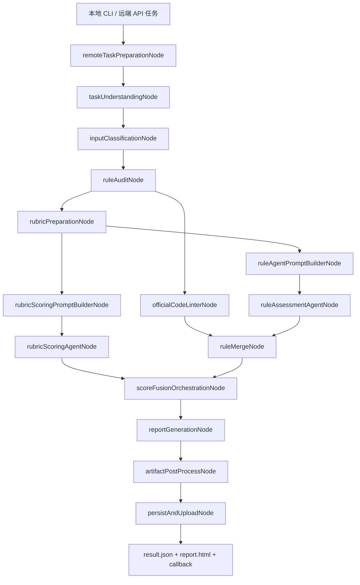
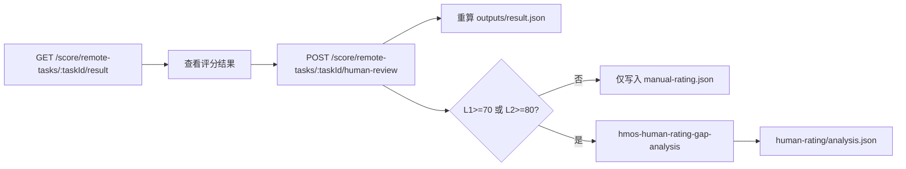

# 架构说明

本文档说明当前代码仓目录结构、主评分 workflow、人工复核与人工评级差异分析流程。

## 总览图

### 主评分 Workflow



### 人工侧流程



## 目录结构

```text
hmos-score-agent/
  README.md                         # 仓库入口，链接到 docs
  package.json                      # npm 脚本、运行依赖和开发依赖
  .env.example                      # 本地环境变量模板
  .opencode/                        # 项目级 opencode 配置、prompt、skill 和运行时目录
    opencode.template.json          # opencode runtime 配置模板
    prompts/                        # agent system prompt
    skills/                         # agent skill 契约
    formatters/                     # JSON formatter
    runtime/                        # 运行时生成目录，不提交
  references/
    scoring/                        # rubric、报告 schema 和评分说明
    rules/                          # 内置规则包 YAML 导出结果
  web/                              # Vue dashboard 前端
    src/                            # 页面、组件、路由和 dashboard API client
    dist/                           # dashboard 构建产物，由 API 服务挂载
  src/
    index.ts                        # Express API 启动入口
    cli.ts                          # 本地 CLI 评分入口
    service.ts                      # case 接收、workflow 执行、远端回调编排
    config.ts                       # 环境变量读取与默认值归一化
    types.ts                        # 远端任务、评分结果、报告等共享类型
    api/                            # HTTP 路由、远端任务 registry、人工接口和规则统计
    agentTrace/                     # opencode run/attempt/event trace 采集、artifact 和 SQLite 摘要
    agent/                          # opencode agent 调用、prompt 构建、输出解析
    dashboard/                      # dashboard 数据聚合、数据读取和内部路由 handler
    humanReview/                    # 逐条人工复核、复核样本写入、复算逻辑
    humanRating/                    # 整单人工评级、差异阈值判断和分析产物
    io/                             # case 加载、下载上传、patch、日志、产物存储
    nodes/                          # LangGraph 节点，每个文件对应一个阶段
    opencode/                       # runtime 配置、serve 管理、CLI runner、sandbox
    report/                         # result.json schema 校验和 HTML 报告渲染
    rules/                          # 静态规则引擎、规则包、官方工具适配
    scoring/                        # rubric 加载、基础评分和分数融合
    workflow/                       # scoreWorkflow、状态定义和流式观测
    tools/                          # 运维和开发辅助脚本
  docs/
    README.md                       # 文档索引
    ARCHITECTURE.md                 # 本文档
    apis/                           # 对外接口文档和 dashboard 内部查询接口索引
    agents/                         # opencode agent 文档
    superpowers/                    # 历史设计文档和实施计划
  tests/                            # node:test 测试用例与 fixtures
  scripts/                          # 部署和运维辅助脚本
  .local-cases/                     # 本地运行产物目录，运行时生成
```

Dashboard API 路由由 `src/dashboard/dashboardHandlers.ts` 注册，供 `web/` 前端和后续 AI 编码查询使用。

Agent Trace 由 `src/agentTrace/` 在 opencode agent 调用时采集 run、attempt 和 event。完整 trace artifact 写入 `outputs/agent-trace.json`，dashboard 摘要接口展示 trace 基础信息，raw 子接口按需读取单个 run 或 event 的原始内容。

## 主评分 Workflow

主流程定义在 `src/workflow/scoreWorkflow.ts`，由 LangGraph 串联节点。入口包括本地 CLI 用例和远端 API 任务，最终输出 `outputs/result.json` 与 `outputs/report.html`。

| 顺序 | 节点 | 职责 |
| --- | --- | --- |
| 1 | `remoteTaskPreparationNode` | 远端任务预处理、下载资源、物化标准 case；本地 case 会直接归一化到后续状态。 |
| 2 | `taskUnderstandingNode` | 构建 opencode sandbox，调用 `hmos-understanding` 提取显式、上下文和隐式约束。 |
| 3 | `inputClassificationNode` | 判定任务类型：`full_generation`、`continuation` 或 `bug_fix`。 |
| 4 | `ruleAuditNode` | 运行静态规则审计，输出确定性结果、Agent 辅助判定候选、证据索引和违规项。 |
| 5a | `officialCodeLinterNode` | 与 rubric 准备并行执行，按配置运行官方 Code Linter，并对变更模块执行 hvigor 编译校验。 |
| 5b | `rubricPreparationNode` | 与官方工具并行执行，加载任务类型对应 rubric，生成评分快照。 |
| 6a | `rubricScoringPromptBuilderNode` | 构建 rubric 评分 payload 和落盘 prompt。 |
| 6b | `ruleAgentPromptBuilderNode` | 构建规则辅助判定 payload 和落盘 prompt。 |
| 7a | `rubricScoringAgentNode` | 调用 `hmos-rubric-scoring` 完成逐项 rubric 评分。 |
| 7b | `ruleAssessmentAgentNode` | 调用 `hmos-rule-assessment` 判定候选规则。 |
| 8 | `ruleMergeNode` | 等待官方工具和规则 agent 完成后，合并静态规则结果、官方工具结果和 agent 规则判定结果。 |
| 9 | `scoreFusionOrchestrationNode` | 等待 rubric 评分和规则合并完成后，融合 rubric 分、规则扣分、硬门槛和构建校验结果。 |
| 10 | `reportGenerationNode` | 生成并校验结构化 `result.json` 数据。 |
| 11 | `artifactPostProcessNode` | 基于结果数据渲染 `report.html`。 |
| 12 | `persistAndUploadNode` | 写入输入、中间产物和输出文件，并按需回调远端平台。 |

`runPreparedScoreWorkflow` 用于从已预处理状态恢复执行，会从 `opencodeSandboxPreparationNode` 重新补建 sandbox，然后进入规则审计、官方工具、rubric 和融合阶段。

## 人工侧流程

| 流程 | 入口 | 行为 |
| --- | --- | --- |
| 人工复核与评级 | `POST /score/remote-tasks/:taskId/human-review` | 读取已完成任务的 `outputs/result.json`，写入人工复核样本，并按 `score_effect` 元数据重算总分、维度分和硬门槛状态；同时写入 `manualLevel` 对应的 `human-rating/manual-rating.json`，当人工评级为 L1 且自动分 >= 70，或人工评级为 L2 且自动分 >= 80 时调用 `hmos-human-rating-gap-analysis`。 |
| 规则违反统计 | 主评分完成后触发 | 远端任务完成时将规则违反快照写入本地统计索引，供 `GET /score/rule-violation-stats` 查询。 |

人工评级差异分析只生成 `human-rating/analysis.json` 和样本数据，不改写原始 `outputs/result.json`。

## 运行产物

默认本地产物根目录是 `.local-cases/`。每次评分会生成独立 case 目录，常见结构如下：

```text
.local-cases/<caseId>/
  inputs/                           # 标准化输入材料
  intermediate/
    constraint-summary.json
    rule-audit.json
    code-linter/
    opencode-sandbox/
  outputs/
    result.json
    report.html
    agent-trace.json                # opencode agent 运行摘要和事件 trace
  human-rating/                     # 人工评级和差异分析产物，仅相关接口触发后存在
  logs/
```

Agent Trace 摘要包含 run、attempt、event、耗时和 token usage，用于 dashboard 任务详情页展示 agent 执行过程。
