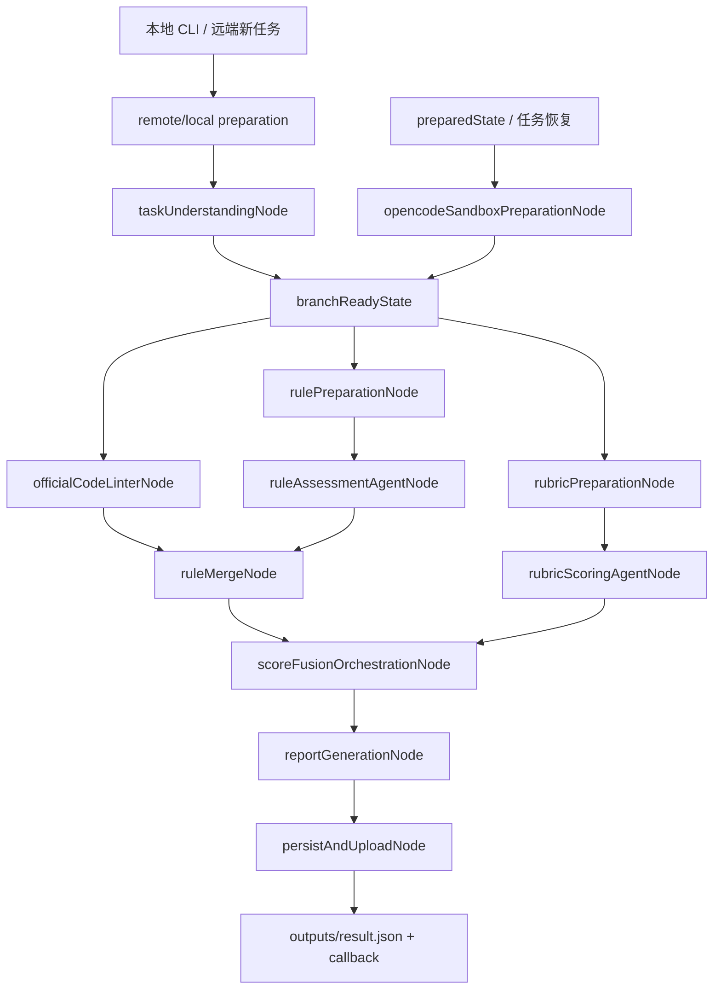
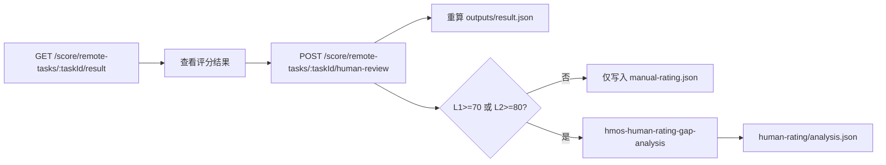

# 架构说明

本文档说明当前代码仓目录结构、主评分 workflow、人工复核与人工评级差异分析流程。

## 总览图

### 主评分 Workflow



### 人工侧流程



## 目录结构

```text
hmos-score-agent/
  README.md                         # 仓库入口，链接到 docs
  package.json                      # npm 脚本、运行依赖和开发依赖
  .env.example                      # 本地环境变量模板
  .opencode/                        # 项目级 opencode 配置、prompt、skill 和运行时目录
    opencode.template.json          # opencode runtime 配置模板
    prompts/                        # agent system prompt
    skills/                         # agent skill 契约
    formatters/                     # JSON formatter
    runtime/                        # 运行时生成目录，不提交
  references/
    scoring/                        # rubric、报告 schema 和评分说明
    rules/                          # 内置规则包 YAML 导出结果
  web/                              # Vue dashboard 前端
    src/                            # 页面、组件、路由和 dashboard API client
    dist/                           # dashboard 构建产物，由 API 服务挂载
  src/
    index.ts                        # Express API 启动入口
    cli.ts                          # 本地 CLI 评分入口
    config.ts                       # 环境变量读取与默认值归一化
    types.ts                        # 远端任务、评分结果、报告等共享类型
    interfaces/                     # API 契约、路径、schema 和 api.d.ts 声明入口
    api/                            # HTTP 路由、远端任务 registry、人工接口和规则统计 handler
    commons/                        # 公共类型、基础工具、case/artifact/download/upload IO
    service/                        # case 接收、workflow 执行、远端回调编排
    workflow/                       # graph 拓扑、状态、节点目录和流式观测
      graph/                        # scoreWorkflow、状态定义、runtime lifecycle
      nodes/                        # 每个 LangGraph 节点一个目录，含 index/types/tools
      observability/                # workflow 事件解释、节点标签和日志
    agents/                         # opencode agent 调用、prompt、runtime、trace 和输出归一化
    datasets/                       # SQLite、dashboard 数据、人工复核/评级、统计数据集
    report/                         # result.json schema 校验和 HTML 报告渲染
    rules/                          # 静态规则引擎、规则包、官方工具适配
    scoring/                        # rubric 加载、基础评分和分数融合
    tools/                          # 运维和开发辅助脚本
  docs/
    README.md                       # 文档索引
    ARCHITECTURE.md                 # 本文档
    apis/                           # 对外接口文档和 dashboard 内部查询接口索引，openapi.yaml 保持在此供人工阅读
    agents/                         # opencode agent 文档
    superpowers/                    # 历史设计文档和实施计划
  tests/                            # node:test 测试用例与 fixtures
  scripts/                          # 部署和运维辅助脚本
  .local-cases/                     # 本地运行产物目录，运行时生成
```

Dashboard API 路由由 `src/datasets/dashboard/dashboardHandlers.ts` 注册，供 `web/` 前端和后续 AI 编码查询使用。

Agent Trace 由 `src/agents/trace/` 在 opencode agent 调用时采集 run、attempt 和 event。完整 trace artifact 写入 `outputs/agent-trace.json`，dashboard 摘要接口展示 trace 基础信息，raw 子接口按需读取单个 run 或 event 的原始内容。

## 主评分 Workflow

主流程定义在 `src/workflow/graph/scoreWorkflow.ts`，由 LangGraph 串联 `src/workflow/nodes/` 下的节点目录。入口包括本地 CLI 用例、远端 API 新任务和已接收远端任务恢复，最终正式输出为 `outputs/result.json`。

| 顺序 | 节点 | 职责 |
| --- | --- | --- |
| 1 | `remoteTaskPreparationNode` / local preparation | 远端任务预处理、下载资源、物化标准 case，读取入口 `taskType`，生成 `effective.patch` 和 patch scope。 |
| 2 | `taskUnderstandingNode` | 构建 opencode sandbox，调用 `hmos-understanding` 输出 `taskUnderstanding`，作为 rule 与 rubric 的共同前置摘要。 |
| 3a | `officialCodeLinterNode` | 与规则、rubric 分支并行，按配置运行官方 Code Linter，并对变更模块执行 hvigor 编译校验。 |
| 3b | `rulePreparationNode` | 与官方工具、rubric 分支并行，运行静态规则审计并构建 rule agent payload。 |
| 3c | `rubricPreparationNode` | 与官方工具、规则分支并行，加载 rubric/risk taxonomy 并构建 rubric scoring payload。 |
| 4a | `ruleAssessmentAgentNode` | 调用 `hmos-rule-assessment` 判定候选规则。 |
| 4b | `rubricScoringAgentNode` | 调用 `hmos-rubric-scoring` 完成逐项 rubric 评分。 |
| 5 | `ruleMergeNode` | 等待官方工具和规则 agent 完成后，合并规则结果并输出统一 `normalizedRuleImpacts`。 |
| 6 | `scoreFusionOrchestrationNode` | 等待 rubric 评分和规则合并完成后，融合 rubric 分、规则扣分、硬门槛和构建校验结果。 |
| 7 | `reportGenerationNode` | 生成并校验结构化 `result.json` 数据。 |
| 8 | `persistAndUploadNode` | 写入输入、中间产物和 `outputs/result.json`，并按需回调远端平台。 |

`runPreparedScoreWorkflow` 用于从已预处理状态恢复执行，会从 `opencodeSandboxPreparationNode` 重新补建 sandbox，然后进入同一组三分支并行主流程。

## 人工侧流程

| 流程 | 入口 | 行为 |
| --- | --- | --- |
| 人工复核与评级 | `POST /score/remote-tasks/:taskId/human-review` | 读取已完成任务的 `outputs/result.json`，写入人工复核样本，并按 `score_effect` 元数据重算总分、维度分和硬门槛状态；同时写入 `manualLevel` 对应的 `human-rating/manual-rating.json`，当人工评级为 L1 且自动分 >= 70，或人工评级为 L2 且自动分 >= 80 时调用 `hmos-human-rating-gap-analysis`。 |
| 规则违反统计 | 主评分完成后触发 | 远端任务完成时将规则违反快照写入本地统计索引，供 `GET /score/rule-violation-stats` 查询。 |

人工评级差异分析只生成 `human-rating/analysis.json` 和样本数据，不改写原始 `outputs/result.json`。

## 运行产物

默认本地产物根目录是 `.local-cases/`。每次评分会生成独立 case 目录，常见结构如下：

```text
.local-cases/<caseId>/
  inputs/                           # 标准化输入材料
  intermediate/
    task-understanding.json
    rule-audit.json
    code-linter/
    opencode-sandbox/
  outputs/
    result.json
    agent-trace.json                # opencode agent 运行摘要和事件 trace
  human-rating/                     # 人工评级和差异分析产物，仅相关接口触发后存在
  logs/
```

Agent Trace 摘要包含 run、attempt、event、耗时和 token usage，用于 dashboard 任务详情页展示 agent 执行过程。
