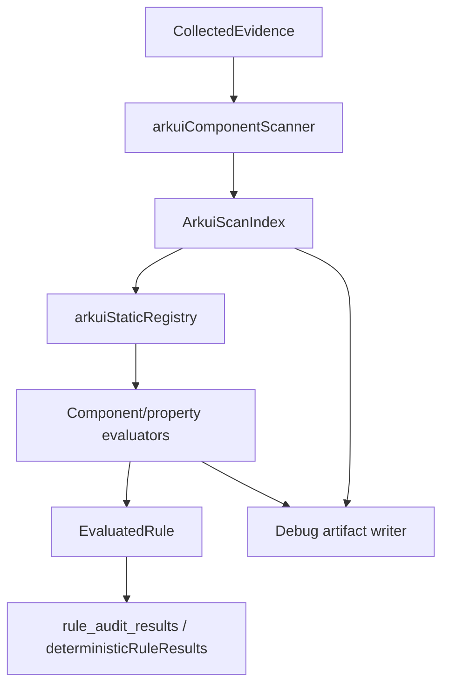

# Cross-Device Static UI Rule Evaluator Design

## Problem

The current cross-device adaptation rule pack contains many ArkUI component rules, but most of them use `case_constraint_precheck`. That evaluator only produces static hints and returns `未接入判定器`; the final pass/fail decision is still made by an agent. This creates inconsistent results for rules whose evidence is syntactic and should be deterministic, such as:

- `Tabs.vertical(...)` mapping `sm/md/lg` incorrectly.
- `List({ space: 12 })` using fixed spacing.
- `GridRow({ columns: ... })` using fixed values instead of breakpoint objects.
- `WaterFlow` dynamically switching columns without `SLIDING_WINDOW`.

We need a full static evaluator for the cross-device UI component rules. The implementation should scan ArkUI component usage once, evaluate all related rules from the same scan index, persist intermediate scan results for early human review, and simplify the rule YAML so the detector configuration carries the precise static check while the natural-language rule text stays short.

## Goals

- Implement all cross-device UI component rules in one static-evaluator framework rather than in batches.
- Use a single scan pass over `.ets` files to produce reusable ArkUI component facts.
- Use a registry model where each rule evaluator is registered by component name, properties, and check id.
- Persist intermediate scan output and per-rule static evaluation traces for manual review during rollout.
- Replace the old sequential `CMP-MUST-*` / `CMP-SHOULD-*` IDs with component-based IDs in one breaking migration.
- Simplify `references/rules/cross-device-adaptation.yaml` rule descriptions and fallback prompts.
- Keep `case_constraint_precheck` as agent-precheck only; do not overload it into a final static evaluator.

## Non-Goals

- Do not preserve old rule IDs through `legacyIds`; this is a one-time breaking switch.
- Do not attempt a full ArkTS parser in this phase. Use a robust lightweight scanner with deterministic expression extraction and conservative `需要复核` output when an expression cannot be resolved.
- Do not migrate non-UI hover, web, or form-factor rules unless they directly share the breakpoint scanner facts.
- Do not remove `arkui_extra`; it remains for existing non-cross-device ArkUI special-case checks.

## Existing Evaluator Boundaries

`arkui_extra` is already static, but it is not the right home for this work.

Current `arkui_extra` checks are hand-written special cases:

- `route_navdestination`
- `multi_bindsheet_same_component`

Those checks scan files directly inside each evaluator. They do not build a reusable component index, do not model breakpoint expressions, and are not organized around component/property registrations. Expanding `arkui_extra` with all cross-device rules would turn it into a large mixed-purpose file.

The new detector mode should be:

```ts
type StaticDetectorMode =
  | "regex"
  | "project_structure"
  | "arkui_extra"
  | "arkui_static"
  | "case_constraint_precheck"
  | "arkts_static"
  | "api_usage";
```

Detector responsibilities:

| Detector | Responsibility |
| --- | --- |
| `arkts_static` | ArkTS language, naming, typing, and style checks. |
| `arkui_extra` | Small ArkUI special-case checks that are not part of the cross-device component rule framework. |
| `arkui_static` | Cross-device ArkUI component and breakpoint rules with reusable scan facts. |
| `case_constraint_precheck` | Agent precheck evidence only; never final static pass/fail. |

## Architecture

### Files

Create:

- `src/rules/evaluators/arkuiComponentScanner.ts`
- `src/rules/evaluators/arkuiExpressionFacts.ts`
- `src/rules/evaluators/arkuiStaticEvaluator.ts`
- `src/rules/evaluators/arkuiStaticRegistry.ts`
- `src/rules/evaluators/arkuiStaticDebugWriter.ts`

Modify:

- `src/rules/engine/ruleTypes.ts`
- `src/rules/ruleEngine.ts`
- `src/rules/engine/rulePackYamlLoader.ts`
- `src/rules/evaluators/shared.ts`
- `references/rules/cross-device-adaptation.yaml`
- Rule-engine and score-agent tests.

### Data Flow



`ArkuiScanIndex` is cached per `CollectedEvidence` with a `WeakMap`, matching the `arkts_static` pattern.

## Scan Facts

### Component Facts

```ts
export interface ArkuiComponentFact {
  id: string;
  component: string;
  relativePath: string;
  line: number;
  endLine: number;
  argsText: string;
  modifiers: ArkuiModifierFact[];
  children: string[];
  parentId?: string;
  surroundingConditions: ArkuiConditionFact[];
  rawSnippet: string;
}

export interface ArkuiModifierFact {
  name: string;
  line: number;
  argsText: string;
  rawText: string;
}

export interface ArkuiConditionFact {
  line: number;
  expression: string;
  kind: "if" | "else_if" | "ternary" | "builder_branch";
}
```

The scanner must capture both constructor-style properties and modifier-style properties:

- `List({ lanes: 2, space: 12 })`
- `.lanes(this.listLanes)`
- `Tabs({ barPosition: ... })`
- `.vertical(this.isWideScreen)`

### Breakpoint and Expression Facts

```ts
export type BreakpointName = "xs" | "sm" | "md" | "lg" | "xl";

export type StaticValue =
  | { kind: "boolean"; value: boolean }
  | { kind: "number"; value: number; unit?: "vp" | "px" | "%" }
  | { kind: "string"; value: string }
  | { kind: "enum"; name: string }
  | { kind: "object"; properties: Record<string, StaticValue> }
  | { kind: "unknown"; reason: string };

export interface BreakpointValueFact {
  expression: string;
  byBreakpoint?: Partial<Record<BreakpointName, StaticValue>>;
  fixed?: StaticValue;
  confidence: "high" | "medium" | "low";
  evidence: string[];
}
```

The expression resolver must support:

- Fixed literals: `true`, `false`, `12`, `'1fr 1fr'`, `BarPosition.Start`.
- Object maps: `{ sm: 1, md: 2, lg: 3, xl: 3 }`.
- Ternaries: `bp === 'lg' ? true : false`.
- Common breakpoint helpers: `this.value.getValue(this.currentBreakpoint)`.
- Getters and simple class fields when defined in the same file.
- Anti-patterns like `currentBreakpoint !== 'sm'`, which maps `md/lg/xl` together.
- Unknown values with a clear reason.

### Debug Artifacts

Static scan artifacts must be written for early manual review. They should be emitted only when enabled by an environment variable or runtime option, so normal scoring output does not become noisy.

Configuration:

- Env var: `HMOS_STATIC_SCAN_DEBUG=1`
- Optional root: `HMOS_STATIC_SCAN_DEBUG_DIR`
- Default root when enabled: `.local-analysis/static-scan-debug`

Directory layout:

```text
.local-analysis/static-scan-debug/<taskId-or-runId>/
  arkui-scan-index.json
  arkui-rule-traces.json
  unresolved-expressions.json
```

`arkui-scan-index.json` contains component facts and breakpoint facts. It must include file paths, line numbers, raw snippets, extracted args, modifiers, parent/child ids, and surrounding conditions.

`arkui-rule-traces.json` contains one item per evaluated rule:

```ts
export interface ArkuiRuleTrace {
  ruleId: string;
  check: string;
  result: "满足" | "不满足" | "不涉及" | "未接入判定器";
  componentIds: string[];
  matchedLocations: string[];
  decisionInputs: Record<string, unknown>;
  decisionReason: string;
}
```

`unresolved-expressions.json` contains expressions that forced a rule into `需要复核` or `不涉及` due to insufficient static information. If the public `StaticRuleResult` type remains unchanged, unresolved rules should use `未接入判定器` with a conclusion that says static scanning found relevant evidence but needs review.

## Registry Design

```ts
export interface ArkuiStaticCheck {
  check: string;
  component?: string;
  properties: string[];
  evaluate(context: ArkuiStaticContext): EvaluatedRule;
}

export interface ArkuiStaticContext {
  rule: RegisteredRule;
  index: ArkuiScanIndex;
  helpers: ArkuiStaticHelpers;
}

export function registerArkuiStaticCheck(check: ArkuiStaticCheck): void;
export function runArkuiStaticRule(rule: RegisteredRule, evidence: CollectedEvidence): EvaluatedRule;
```

Rules are registered once:

```ts
registerArkuiStaticCheck({
  check: "tabs_vertical_by_breakpoint",
  component: "Tabs",
  properties: ["vertical"],
  evaluate: evaluateTabsVerticalByBreakpoint,
});
```

The evaluator finds `rule.detector.config.check`, looks up the check, and runs it against the cached index.

## Component-Based Rule IDs

Rule IDs should be replaced in one migration. Old IDs are removed from the YAML. There is no `legacyIds` compatibility layer.

ID format:

```text
CMP-<COMPONENT>-MUST-<NN>
CMP-<COMPONENT>-SHOULD-<NN>
RSP-BREAKPOINT-MUST-<NN>
CFG-MODULE-MUST-<NN>
```

Use uppercase component names:

- `LIST`
- `WATERFLOW`
- `SWIPER`
- `GRID`
- `SIDEBAR`
- `TABS`
- `GRIDROW`
- `GRIDCOL`
- `FLEX`
- `ROWCOLUMN`
- `NAVIGATION`
- `SCROLL`
- `ASPECTRATIO`
- `CONSTRAINT`
- `BREAKPOINT`

### ID Mapping

| Old ID | New ID |
| --- | --- |
| `CFG-MUST-01` | `CFG-MODULE-MUST-01` |
| `RSP-MUST-01` | `RSP-BREAKPOINT-MUST-01` |
| `RSP-MUST-02` | `RSP-BREAKPOINT-MUST-02` |
| `RSP-MUST-03` | `RSP-BREAKPOINT-MUST-03` |
| `RSP-MUST-04` | `RSP-BREAKPOINT-MUST-04` |
| `RSP-MUST-05` | `RSP-BREAKPOINT-MUST-05` |
| `RSP-MUST-06` | `RSP-BREAKPOINT-MUST-06` |
| `RSP-MUST-07` | `RSP-BREAKPOINT-MUST-07` |
| `CMP-MUST-01` | `CMP-LIST-MUST-01` |
| `CMP-SHOULD-01` | `CMP-LIST-SHOULD-01` |
| `CMP-SHOULD-02` | `CMP-LIST-SHOULD-02` |
| `CMP-MUST-02` | `CMP-WATERFLOW-MUST-01` |
| `CMP-SHOULD-03` | `CMP-WATERFLOW-SHOULD-01` |
| `CMP-SHOULD-04` | `CMP-WATERFLOW-SHOULD-02` |
| `CMP-MUST-03` | `CMP-SWIPER-MUST-01` |
| `CMP-MUST-04` | `CMP-SWIPER-MUST-02` |
| `CMP-MUST-17` | `CMP-SWIPER-MUST-03` |
| `CMP-MUST-05` | `CMP-GRID-MUST-01` |
| `CMP-MUST-06` | `CMP-SIDEBAR-MUST-01` |
| `CMP-MUST-07` | `CMP-SIDEBAR-MUST-02` |
| `CMP-MUST-08` | `CMP-SIDEBAR-MUST-03` |
| `CMP-MUST-10` | `CMP-TABS-MUST-01` |
| `CMP-MUST-11` | `CMP-TABS-MUST-02` |
| `CMP-MUST-12` | `CMP-TABS-MUST-03` |
| `CMP-MUST-13` | `CMP-GRIDROW-MUST-01` |
| `CMP-SHOULD-06` | `CMP-GRIDROW-SHOULD-01` |
| `CMP-MUST-14` | `CMP-GRIDCOL-MUST-01` |
| `CMP-SHOULD-07` | `CMP-GRIDCOL-SHOULD-01` |
| `CMP-MUST-15` | `CMP-FLEX-MUST-01` |
| `CMP-SHOULD-08` | `CMP-FLEX-SHOULD-01` |
| `CMP-SHOULD-09` | `CMP-FLEX-SHOULD-02` |
| `CMP-SHOULD-10` | `CMP-ROWCOLUMN-SHOULD-01` |
| `CMP-SHOULD-11` | `CMP-ROWCOLUMN-SHOULD-02` |
| `CMP-SHOULD-12` | `CMP-ROWCOLUMN-SHOULD-03` |
| `CMP-SHOULD-05` | `CMP-NAVIGATION-SHOULD-01` |
| `CMP-SHOULD-13` | `CMP-SCROLL-SHOULD-01` |
| `CMP-SHOULD-14` | `CMP-ASPECTRATIO-SHOULD-01` |
| `CMP-SHOULD-15` | `CMP-ASPECTRATIO-SHOULD-02` |
| `CMP-SHOULD-16` | `CMP-CONSTRAINT-SHOULD-01` |

## YAML Simplification

Each static UI rule should use:

- One short `rule` sentence.
- `detector.kind: static`
- `detector.mode: arkui_static`
- `detector.config.check`
- `detector.config.targetPatterns`
- Optional small static config, such as expected breakpoint values.
- Short decision criteria.
- No duplicated long `llmPrompt` under every rule.

Example:

```yaml
- id: RSP-BREAKPOINT-MUST-03
  rule: 断点值分发工具必须覆盖 sm/md/lg/xl。
  detector:
    kind: static
    mode: arkui_static
    config:
      check: breakpoint_value_provider_complete
      targetPatterns:
        - '**/*.ets'
      breakpoints:
        - sm
        - md
        - lg
        - xl
  fallback:
    policy: agent_assisted
  decisionCriteria:
    pass:
      - 静态扫描确认断点值分发工具覆盖 sm/md/lg/xl，或工程未使用断点值分发工具。
    fail:
      - 静态扫描发现断点值分发工具缺少任一断点。
    notApplicable:
      - 工程未使用断点值分发工具。
    review:
      - 表达式或断点来源无法静态解析。
```

Fallback prompt should be generated centrally, not repeated in YAML:

```text
静态扫描无法完整判定规则 <rule_id>。请仅复核以下扫描位置和表达式，不要自由重扫全工程：<locations>。
```

## Rule Coverage by Component

### Breakpoint Support

| Rule | Check | Scan Inputs |
| --- | --- | --- |
| `RSP-BREAKPOINT-MUST-01` | `breakpoint_range_recommended` | `GridRow.breakpoints.value`, custom breakpoint constants, helper thresholds. |
| `RSP-BREAKPOINT-MUST-02` | `no_hardcoded_width_breakpoint_condition` | Binary expressions using width/vp/screenWidth with `600`, `840`, `1440`. |
| `RSP-BREAKPOINT-MUST-03` | `breakpoint_value_provider_complete` | `BreakpointType`, `BreakpointValue`, `ResponsiveValue`, constructor params, `getValue` branches. |
| `RSP-BREAKPOINT-MUST-04` | `page_breakpoint_source_allowed` | `WidthBreakpoint`, `mediaquery`, `windowSizeChange`, `onAreaChange`, custom width calculation. |
| `RSP-BREAKPOINT-MUST-05` | `breakpoint_listener_source_allowed` | `window.on('windowSizeChange')`, `mediaquery.matchMediaSync`, `display.on('change')`, banned listeners. |
| `RSP-BREAKPOINT-MUST-06` | `breakpoint_listener_registration_timing` | Listener registration location: `loadContent` callback, `aboutToAppear`, `onCreate`, top-level. |
| `RSP-BREAKPOINT-MUST-07` | `gridrow_breakpoints_value_recommended` | `GridRow({ breakpoints: { value: [...] } })`. |

### Components

| Component | Rules | Scan Inputs |
| --- | --- | --- |
| `List` | `CMP-LIST-MUST-01`, `CMP-LIST-SHOULD-01`, `CMP-LIST-SHOULD-02`, `CMP-SCROLL-SHOULD-01` | `lanes`, `space`, `divider`, `listDirection(Axis.Horizontal)`. |
| `WaterFlow` | `CMP-WATERFLOW-MUST-01`, `CMP-WATERFLOW-SHOULD-01`, `CMP-WATERFLOW-SHOULD-02` | `columnsTemplate`, `layoutMode`, `itemConstraintSize`, `FlowItem` child size constraints. |
| `Swiper` | `CMP-SWIPER-MUST-01`, `CMP-SWIPER-MUST-02`, `CMP-SWIPER-MUST-03` | `displayCount`, `indicator`, `prevMargin`, `nextMargin`, fullscreen exclusion signals. |
| `Grid` | `CMP-GRID-MUST-01` | `columnsTemplate`. |
| `SideBarContainer` | `CMP-SIDEBAR-MUST-01`, `CMP-SIDEBAR-MUST-02`, `CMP-SIDEBAR-MUST-03` | constructor type, `showSideBar`, `sideBarWidth`. |
| `Tabs` | `CMP-TABS-MUST-01`, `CMP-TABS-MUST-02`, `CMP-TABS-MUST-03` | `vertical`, `barPosition`, `barWidth`, `barHeight`; cross-check vertical/barPosition consistency. |
| `GridRow` | `CMP-GRIDROW-MUST-01`, `CMP-GRIDROW-SHOULD-01`, `RSP-BREAKPOINT-MUST-07` | `columns`, `gutter`, `breakpoints.value`. |
| `GridCol` | `CMP-GRIDCOL-MUST-01`, `CMP-GRIDCOL-SHOULD-01` | `span`, `offset`, parent `GridRow.columns`. |
| `Flex` | `CMP-FLEX-MUST-01`, `CMP-FLEX-SHOULD-01`, `CMP-FLEX-SHOULD-02`, shared row/column rules | `flexGrow`, `flexShrink`, `justifyContent`, `wrap`, child layout modifiers. |
| `Row` / `Column` | `CMP-ROWCOLUMN-SHOULD-01`, `CMP-ROWCOLUMN-SHOULD-02`, `CMP-ROWCOLUMN-SHOULD-03` | child `layoutWeight`, percent `width/height`, `displayPriority`, `Blank`, fixed empty containers. |
| `Navigation` | `CMP-NAVIGATION-SHOULD-01` | `mode`, `NavigationMode.Split`, `navBarWidth`. |
| `Scroll` | `CMP-SCROLL-SHOULD-01` | `scrollable(ScrollDirection.Horizontal)`, child `Row/Column`, horizontal list alternative. |
| Any component | `CMP-ASPECTRATIO-SHOULD-01`, `CMP-ASPECTRATIO-SHOULD-02`, `CMP-CONSTRAINT-SHOULD-01` | `aspectRatio`, `width`, `height`, `constraintSize`, dynamic maxWidth/width with breakpoint expressions. |

## Evaluation Semantics

Evaluators should use conservative deterministic rules:

- Return `不满足` when the scan finds explicit violation evidence.
- Return `满足` when all relevant component instances are statically resolvable and conform.
- Return `不涉及` when no relevant component or scenario exists.
- Return `未接入判定器` with a review conclusion when relevant syntax exists but the expression cannot be resolved safely.

This keeps false positives low and makes early scan artifacts useful for human review.

## Result and Risk Impact

After migration, these rules should appear in deterministic rule results. Agent-assisted candidates should only contain unresolved cases. Risk generation should use the new rule IDs directly. Historical dashboards and consistency reports will show old IDs for old results and new IDs for new results; no compatibility mapping is required.

## Testing Strategy

Unit tests:

- Scanner extracts constructor args, modifiers, parent/child links, and conditions.
- Scanner resolves fixed literals, object maps, ternaries, `currentBreakpoint !== 'sm'`, and simple helper `getValue` patterns.
- Each component registry check has at least one pass, fail, not-applicable, and unresolved test where applicable.
- Debug writer emits stable JSON when `HMOS_STATIC_SCAN_DEBUG=1`.

Integration tests:

- `runRuleEngine` evaluates migrated YAML rules as deterministic results.
- `case_constraint_precheck` behavior remains unchanged for non-migrated case rules.
- C-004-like fixture deterministically reports `CMP-TABS-MUST-01`, `CMP-TABS-MUST-02`, `CMP-LIST-SHOULD-01`, `CMP-GRIDROW-MUST-01`, and `RSP-BREAKPOINT-MUST-03`.
- Rule audit results contain new component-based IDs only.

Regression tests:

- Existing `arkui_extra` tests continue to pass.
- Existing `arkts_static` tests continue to pass.
- YAML loader accepts `arkui_static` mode and rejects unknown checks with a clear error.

## Rollout

This is a breaking rule-pack migration. The implementation should land in one branch and switch the YAML IDs and detector modes in the same change as the static evaluator.

Early rollout should run scoring with `HMOS_STATIC_SCAN_DEBUG=1` on known consistency cases such as C-004. Human reviewers should inspect:

- Whether `arkui-scan-index.json` found the correct component instances.
- Whether `arkui-rule-traces.json` used the right decision inputs.
- Whether unresolved expressions are legitimate scanner limitations.

Once scan artifacts are validated, debug output can remain opt-in for future investigations.

## Success Criteria

- All UI component rules in the cross-device rule pack use component-based IDs.
- All UI component rules use `arkui_static` unless explicitly documented as unsuitable.
- Static scan debug artifacts can be produced for every scoring run.
- C-004-style Tabs/List/GridRow/WaterFlow issues are reported deterministically.
- The rule YAML is substantially shorter: rule text is one concise sentence, detector config contains `check`, and repeated long `llmPrompt` text is removed.
- Agent involvement is limited to unresolved cases, not ordinary component/property checks.
