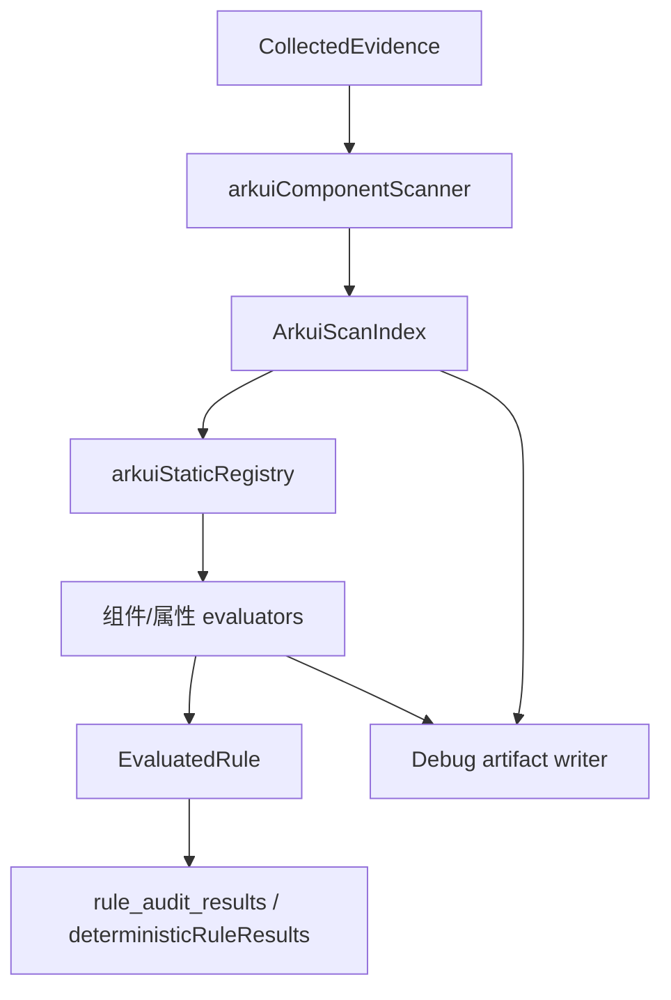

# 一多 UI 规则静态判定器设计

## 问题

当前一多适配规则集包含大量 ArkUI 组件规则，但大多数规则使用 `case_constraint_precheck`。该 evaluator 只产生静态辅助证据，并返回 `未接入判定器`；最终“满足/不满足”仍由 agent 判断。对于证据本身就是语法结构、理应确定性判定的规则，这会造成一致性波动，例如：

- `Tabs.vertical(...)` 对 `sm/md/lg` 的映射错误。
- `List({ space: 12 })` 使用固定间距。
- `GridRow({ columns: ... })` 使用固定值，而不是断点对象。
- `WaterFlow` 动态切换列数但未使用 `SLIDING_WINDOW`。

需要为一多 UI 组件规则实现完整静态判定器。实现应一次扫描 ArkUI 组件用法，从同一份扫描索引中判定所有相关规则，落盘中间扫描结果供早期人工复核，并精简规则 YAML：由 detector 配置承载精确静态检查，规则自然语言保持短句。

## 目标

- 一次性实现全部一多 UI 组件规则的静态判定框架，不分批迁移。
- 对 `.ets` 文件做单次扫描，生成可复用的 ArkUI 组件 facts。
- 使用注册式模型：每个规则 evaluator 按组件名、属性和 check id 注册。
- 落盘中间扫描结果和每条规则的静态判定 trace，供 rollout 期间人工复核。
- 将旧的 `CMP-*` / `RSP-*` / `CFG-*` ID 一次性替换为统一 `OM-*` 组件化 ID。
- 精简 `references/rules/cross-device-adaptation.yaml` 中的规则描述和 fallback prompt。
- 保持 `case_constraint_precheck` 仅用于 agent 前置辅助证据，不扩展成最终静态判定器。

## 非目标

- 不通过 `legacyIds` 保留旧规则 ID；这是一次性 breaking 切换。
- 本阶段不实现完整 ArkTS parser。使用稳健的轻量扫描器做确定性表达式抽取；无法解析的表达式保守进入复核状态。
- 除非直接复用断点扫描 facts，否则不迁移非 UI 的悬停态、Web 或设备形态规则。
- 不移除 `arkui_extra`；它继续承载现有非一多组件框架的 ArkUI 特例检查。

## 现有 Evaluator 边界

`arkui_extra` 已经是静态扫描，但它不是本次工作的合适承载点。

当前 `arkui_extra` 只接了两个手写特例：

- `route_navdestination`
- `multi_bindsheet_same_component`

这些检查在每个 evaluator 内部直接扫描文件。它们不构建可复用组件索引，不建模断点表达式，也不是围绕“组件/属性/规则注册”组织。若把全部一多规则继续塞进 `arkui_extra`，它会变成一个职责混杂的大文件。

新增 detector mode：

```ts
type StaticDetectorMode =
  | "regex"
  | "project_structure"
  | "arkui_extra"
  | "arkui_static"
  | "case_constraint_precheck"
  | "arkts_static"
  | "api_usage";
```

Detector 职责：

| Detector | 职责 |
| --- | --- |
| `arkts_static` | ArkTS 语言、命名、类型和风格类静态检查。 |
| `arkui_extra` | 少量 ArkUI 特例检查，不属于一多组件规则框架。 |
| `arkui_static` | 一多 ArkUI 组件与断点规则，使用可复用扫描 facts。 |
| `case_constraint_precheck` | 仅提供 agent 前置证据，不直接产出最终静态满足/不满足。 |

## 架构

### 文件

新增：

- `src/rules/evaluators/arkuiComponentScanner.ts`
- `src/rules/evaluators/arkuiExpressionFacts.ts`
- `src/rules/evaluators/arkuiStaticEvaluator.ts`
- `src/rules/evaluators/arkuiStaticRegistry.ts`
- `src/rules/evaluators/arkuiStaticDebugWriter.ts`

修改：

- `src/rules/engine/ruleTypes.ts`
- `src/rules/ruleEngine.ts`
- `src/rules/engine/rulePackYamlLoader.ts`
- `src/rules/evaluators/shared.ts`
- `references/rules/cross-device-adaptation.yaml`
- rule-engine 和 score-agent 相关测试。

### 数据流



`ArkuiScanIndex` 按 `CollectedEvidence` 使用 `WeakMap` 缓存，沿用 `arkts_static` 的模式。

## 扫描 Facts

### 组件 Facts

```ts
export interface ArkuiComponentFact {
  id: string;
  component: string;
  relativePath: string;
  line: number;
  endLine: number;
  argsText: string;
  modifiers: ArkuiModifierFact[];
  children: string[];
  parentId?: string;
  surroundingConditions: ArkuiConditionFact[];
  rawSnippet: string;
}

export interface ArkuiModifierFact {
  name: string;
  line: number;
  argsText: string;
  rawText: string;
}

export interface ArkuiConditionFact {
  line: number;
  expression: string;
  kind: "if" | "else_if" | "ternary" | "builder_branch";
}
```

扫描器必须同时捕获构造参数属性和链式 modifier 属性：

- `List({ lanes: 2, space: 12 })`
- `.lanes(this.listLanes)`
- `Tabs({ barPosition: ... })`
- `.vertical(this.isWideScreen)`

### 断点与表达式 Facts

```ts
export type BreakpointName = "xs" | "sm" | "md" | "lg" | "xl";

export type StaticValue =
  | { kind: "boolean"; value: boolean }
  | { kind: "number"; value: number; unit?: "vp" | "px" | "%" }
  | { kind: "string"; value: string }
  | { kind: "enum"; name: string }
  | { kind: "object"; properties: Record<string, StaticValue> }
  | { kind: "unknown"; reason: string };

export interface BreakpointValueFact {
  expression: string;
  byBreakpoint?: Partial<Record<BreakpointName, StaticValue>>;
  fixed?: StaticValue;
  confidence: "high" | "medium" | "low";
  evidence: string[];
}
```

表达式解析器必须支持：

- 固定字面量：`true`、`false`、`12`、`'1fr 1fr'`、`BarPosition.Start`。
- 断点对象：`{ sm: 1, md: 2, lg: 3, xl: 3 }`。
- 三元表达式：`bp === 'lg' ? true : false`。
- 常见断点 helper：`this.value.getValue(this.currentBreakpoint)`。
- 同文件内定义的 getter 和简单 class field。
- 反模式：`currentBreakpoint !== 'sm'`，即把 `md/lg/xl` 归为同一分支。
- 无法解析时给出明确原因。

### Debug 产物

静态扫描中间态必须可落盘，供早期人工复核。该输出只在环境变量或运行时选项开启时生成，避免普通评分输出变得嘈杂。

配置：

- 环境变量：`HMOS_STATIC_SCAN_DEBUG=1`
- 产物目录固定为当前 case 目录下的 `intermediate/arkui-static-scan/`
- 不额外支持全局 debug 根目录，避免扫描证据脱离对应 case

目录结构：

```text
<caseDir>/intermediate/arkui-static-scan/
  arkui-scan-index.json
  arkui-rule-traces.json
  unresolved-expressions.json
```

`arkui-scan-index.json` 包含组件 facts 和断点 facts。必须包含文件路径、行号、原始片段、抽取出的 args、modifiers、父子 id 和条件上下文。

`arkui-rule-traces.json` 每条被判定规则一项：

```ts
export interface ArkuiRuleTrace {
  ruleId: string;
  check: string;
  result: "满足" | "不满足" | "不涉及" | "未接入判定器";
  componentIds: string[];
  matchedLocations: string[];
  decisionInputs: Record<string, unknown>;
  decisionReason: string;
}
```

`unresolved-expressions.json` 包含导致规则需要复核或无法静态完成判定的表达式。如果公共 `StaticRuleResult` 类型暂不增加“需要复核”，则这类规则使用 `未接入判定器`，并在 conclusion 中说明静态扫描找到了相关证据但需要复核。

## 注册式设计

```ts
export interface ArkuiStaticCheck {
  check: string;
  component?: string;
  properties: string[];
  evaluate(context: ArkuiStaticContext): EvaluatedRule;
}

export interface ArkuiStaticContext {
  rule: RegisteredRule;
  index: ArkuiScanIndex;
  helpers: ArkuiStaticHelpers;
}

export function registerArkuiStaticCheck(check: ArkuiStaticCheck): void;
export function runArkuiStaticRule(rule: RegisteredRule, evidence: CollectedEvidence): EvaluatedRule;
```

规则注册示例：

```ts
registerArkuiStaticCheck({
  check: "tabs_vertical_by_breakpoint",
  component: "Tabs",
  properties: ["vertical"],
  evaluate: evaluateTabsVerticalByBreakpoint,
});
```

Evaluator 从 `rule.detector.config.check` 读取 check id，查 registry，并基于缓存后的 index 执行对应 evaluator。

## 组件化规则 ID

规则 ID 在一次迁移中整体替换。旧 ID 从 YAML 中移除，不提供 `legacyIds` 兼容层。

所有一多规则统一使用 `OM` 前缀，避免 `CFG`、`RSP`、`CMP` 这类来源/类别前缀带来的语义不清。

ID 格式：

```text
OM-<COMPONENT>-MUST-<NN>
OM-<COMPONENT>-SHOULD-<NN>
OM-BREAKPOINT-MUST-<NN>
OM-MODULE-MUST-<NN>
```

组件名使用大写：

- `LIST`
- `WATERFLOW`
- `SWIPER`
- `GRID`
- `SIDEBAR`
- `TABS`
- `GRIDROW`
- `GRIDCOL`
- `FLEX`
- `ROWCOLUMN`
- `NAVIGATION`
- `SCROLL`
- `ASPECTRATIO`
- `CONSTRAINT`
- `BREAKPOINT`

### ID 映射

| 旧 ID | 新 ID |
| --- | --- |
| `CFG-MUST-01` | `OM-MODULE-MUST-01` |
| `RSP-MUST-01` | `OM-BREAKPOINT-MUST-01` |
| `RSP-MUST-02` | `OM-BREAKPOINT-MUST-02` |
| `RSP-MUST-03` | `OM-BREAKPOINT-MUST-03` |
| `RSP-MUST-04` | `OM-BREAKPOINT-MUST-04` |
| `RSP-MUST-05` | `OM-BREAKPOINT-MUST-05` |
| `RSP-MUST-06` | `OM-BREAKPOINT-MUST-06` |
| `RSP-MUST-07` | `OM-BREAKPOINT-MUST-07` |
| `CMP-MUST-01` | `OM-LIST-MUST-01` |
| `CMP-SHOULD-01` | `OM-LIST-SHOULD-01` |
| `CMP-SHOULD-02` | `OM-LIST-SHOULD-02` |
| `CMP-MUST-02` | `OM-WATERFLOW-MUST-01` |
| `CMP-SHOULD-03` | `OM-WATERFLOW-SHOULD-01` |
| `CMP-SHOULD-04` | `OM-WATERFLOW-SHOULD-02` |
| `CMP-MUST-03` | `OM-SWIPER-MUST-01` |
| `CMP-MUST-04` | `OM-SWIPER-MUST-02` |
| `CMP-MUST-17` | `OM-SWIPER-MUST-03` |
| `CMP-MUST-05` | `OM-GRID-MUST-01` |
| `CMP-MUST-06` | `OM-SIDEBAR-MUST-01` |
| `CMP-MUST-07` | `OM-SIDEBAR-MUST-02` |
| `CMP-MUST-08` | `OM-SIDEBAR-MUST-03` |
| `CMP-MUST-10` | `OM-TABS-MUST-01` |
| `CMP-MUST-11` | `OM-TABS-MUST-02` |
| `CMP-MUST-12` | `OM-TABS-MUST-03` |
| `CMP-MUST-13` | `OM-GRIDROW-MUST-01` |
| `CMP-SHOULD-06` | `OM-GRIDROW-SHOULD-01` |
| `CMP-MUST-14` | `OM-GRIDCOL-MUST-01` |
| `CMP-SHOULD-07` | `OM-GRIDCOL-SHOULD-01` |
| `CMP-MUST-15` | `OM-FLEX-MUST-01` |
| `CMP-SHOULD-08` | `OM-FLEX-SHOULD-01` |
| `CMP-SHOULD-09` | `OM-FLEX-SHOULD-02` |
| `CMP-SHOULD-10` | `OM-ROWCOLUMN-SHOULD-01` |
| `CMP-SHOULD-11` | `OM-ROWCOLUMN-SHOULD-02` |
| `CMP-SHOULD-12` | `OM-ROWCOLUMN-SHOULD-03` |
| `CMP-SHOULD-05` | `OM-NAVIGATION-SHOULD-01` |
| `CMP-SHOULD-13` | `OM-SCROLL-SHOULD-01` |
| `CMP-SHOULD-14` | `OM-ASPECTRATIO-SHOULD-01` |
| `CMP-SHOULD-15` | `OM-ASPECTRATIO-SHOULD-02` |
| `CMP-SHOULD-16` | `OM-CONSTRAINT-SHOULD-01` |

## YAML 精简

每条静态 UI 规则使用以下结构：

- 一句简短 `rule`。
- `detector.kind: static`
- `detector.mode: arkui_static`
- `detector.config.check`
- `detector.config.targetPatterns`
- 可选的少量静态配置，例如期望断点值。
- 简短 decision criteria。
- 不在每条规则里重复长篇 `llmPrompt`。

示例：

```yaml
- id: OM-BREAKPOINT-MUST-03
  rule: 断点值分发工具必须覆盖 sm/md/lg/xl。
  detector:
    kind: static
    mode: arkui_static
    config:
      check: breakpoint_value_provider_complete
      targetPatterns:
        - '**/*.ets'
      breakpoints:
        - sm
        - md
        - lg
        - xl
  fallback:
    policy: agent_assisted
  decisionCriteria:
    pass:
      - 静态扫描确认断点值分发工具覆盖 sm/md/lg/xl，或工程未使用断点值分发工具。
    fail:
      - 静态扫描发现断点值分发工具缺少任一断点。
    notApplicable:
      - 工程未使用断点值分发工具。
    review:
      - 表达式或断点来源无法静态解析。
```

Fallback prompt 由中心逻辑生成，不在 YAML 中重复：

```text
静态扫描无法完整判定规则 <rule_id>。请仅复核以下扫描位置和表达式，不要自由重扫全工程：<locations>。
```

## 规则覆盖范围

### 断点支撑规则

| 规则 | Check | 扫描输入 |
| --- | --- | --- |
| `OM-BREAKPOINT-MUST-01` | `breakpoint_range_recommended` | `GridRow.breakpoints.value`、自定义断点常量、helper 阈值。 |
| `OM-BREAKPOINT-MUST-02` | `no_hardcoded_width_breakpoint_condition` | 使用 width/vp/screenWidth 与 `600`、`840`、`1440` 比较的二元表达式。 |
| `OM-BREAKPOINT-MUST-03` | `breakpoint_value_provider_complete` | `BreakpointType`、`BreakpointValue`、`ResponsiveValue`、构造参数、`getValue` 分支。 |
| `OM-BREAKPOINT-MUST-04` | `page_breakpoint_source_allowed` | `WidthBreakpoint`、`mediaquery`、`windowSizeChange`、`onAreaChange`、自定义宽度计算。 |
| `OM-BREAKPOINT-MUST-05` | `breakpoint_listener_source_allowed` | `window.on('windowSizeChange')`、`mediaquery.matchMediaSync`、`display.on('change')`、禁止的监听来源。 |
| `OM-BREAKPOINT-MUST-06` | `breakpoint_listener_registration_timing` | 监听注册位置：`loadContent` 回调、`aboutToAppear`、`onCreate`、顶层语句。 |
| `OM-BREAKPOINT-MUST-07` | `gridrow_breakpoints_value_recommended` | `GridRow({ breakpoints: { value: [...] } })`。 |

### 组件规则

| 组件 | 规则 | 扫描输入 |
| --- | --- | --- |
| `List` | `OM-LIST-MUST-01`、`OM-LIST-SHOULD-01`、`OM-LIST-SHOULD-02`、`OM-SCROLL-SHOULD-01` | `lanes`、`space`、`divider`、`listDirection(Axis.Horizontal)`。 |
| `WaterFlow` | `OM-WATERFLOW-MUST-01`、`OM-WATERFLOW-SHOULD-01`、`OM-WATERFLOW-SHOULD-02` | `columnsTemplate`、`layoutMode`、`itemConstraintSize`、`FlowItem` 子项尺寸约束。 |
| `Swiper` | `OM-SWIPER-MUST-01`、`OM-SWIPER-MUST-02`、`OM-SWIPER-MUST-03` | `displayCount`、`indicator`、`prevMargin`、`nextMargin`、全屏排除信号。 |
| `Grid` | `OM-GRID-MUST-01` | `columnsTemplate`。 |
| `SideBarContainer` | `OM-SIDEBAR-MUST-01`、`OM-SIDEBAR-MUST-02`、`OM-SIDEBAR-MUST-03` | 构造 type、`showSideBar`、`sideBarWidth`。 |
| `Tabs` | `OM-TABS-MUST-01`、`OM-TABS-MUST-02`、`OM-TABS-MUST-03` | `vertical`、`barPosition`、`barWidth`、`barHeight`；同时校验 vertical/barPosition 一致性。 |
| `GridRow` | `OM-GRIDROW-MUST-01`、`OM-GRIDROW-SHOULD-01`、`OM-BREAKPOINT-MUST-07` | `columns`、`gutter`、`breakpoints.value`。 |
| `GridCol` | `OM-GRIDCOL-MUST-01`、`OM-GRIDCOL-SHOULD-01` | `span`、`offset`、父级 `GridRow.columns`。 |
| `Flex` | `OM-FLEX-MUST-01`、`OM-FLEX-SHOULD-01`、`OM-FLEX-SHOULD-02`、共享 Row/Column 规则 | `flexGrow`、`flexShrink`、`justifyContent`、`wrap`、子项布局 modifier。 |
| `Row` / `Column` | `OM-ROWCOLUMN-SHOULD-01`、`OM-ROWCOLUMN-SHOULD-02`、`OM-ROWCOLUMN-SHOULD-03` | 子项 `layoutWeight`、百分比 `width/height`、`displayPriority`、`Blank`、固定空容器。 |
| `Navigation` | `OM-NAVIGATION-SHOULD-01` | `mode`、`NavigationMode.Split`、`navBarWidth`。 |
| `Scroll` | `OM-SCROLL-SHOULD-01` | `scrollable(ScrollDirection.Horizontal)`、子级 `Row/Column`、横向 List 替代实现。 |
| 任意组件 | `OM-ASPECTRATIO-SHOULD-01`、`OM-ASPECTRATIO-SHOULD-02`、`OM-CONSTRAINT-SHOULD-01` | `aspectRatio`、`width`、`height`、`constraintSize`、带断点表达式的动态 maxWidth/width。 |

## 判定语义

Evaluator 使用保守确定性规则：

- 扫描到明确违规证据时返回 `不满足`。
- 所有相关组件实例都能静态解析且符合规则时返回 `满足`。
- 没有相关组件或适用场景时返回 `不涉及`。
- 相关语法存在但表达式无法安全解析时，返回 `未接入判定器` 并在 conclusion 中说明需要复核。

这样可以降低误报，同时让早期扫描产物更适合人工复核。

## 结果与风险影响

迁移后，这些规则应进入 deterministic rule results。Agent-assisted candidates 只保留无法静态解析的场景。风险生成直接使用新的规则 ID。历史 dashboard 和一致性报告中，旧结果显示旧 ID，新结果显示新 ID；不需要兼容映射。

## 测试策略

单元测试：

- Scanner 能抽取构造参数、modifiers、父子关系和条件上下文。
- Scanner 能解析固定字面量、断点对象、三元表达式、`currentBreakpoint !== 'sm'` 和简单 `getValue` helper。
- 每个组件 registry check 至少覆盖满足、不满足、不涉及；适用时覆盖无法解析。
- `HMOS_STATIC_SCAN_DEBUG=1` 时 debug writer 生成稳定 JSON。

集成测试：

- `runRuleEngine` 能将迁移后的 YAML 规则判定为 deterministic results。
- 非迁移 case 规则的 `case_constraint_precheck` 行为保持不变。
- 覆盖 Tabs/List/GridRow/BreakpointValueProvider 的 fixture 能稳定报告 `OM-TABS-MUST-01`、`OM-TABS-MUST-02`、`OM-LIST-SHOULD-01`、`OM-GRIDROW-MUST-01` 和 `OM-BREAKPOINT-MUST-03`。
- rule audit results 只包含新的组件化 ID。

回归测试：

- 现有 `arkui_extra` 测试继续通过。
- 现有 `arkts_static` 测试继续通过。
- YAML loader 接受 `arkui_static` mode，并对未知 check 给出清晰错误。

## Rollout

这是一次 breaking 的规则集迁移。实现应在同一个分支中同时切换 YAML ID、detector mode 和静态 evaluator。

早期 rollout 由人工选择代表性一多案例开启 `HMOS_STATIC_SCAN_DEBUG=1` 运行评分。人工复核重点：

- `arkui-scan-index.json` 是否找到正确的组件实例。
- `arkui-rule-traces.json` 是否使用了正确的判定输入。
- `unresolved-expressions.json` 中的无法解析项是否确实是扫描器限制。

扫描产物确认无误后，debug 输出仍保留为后续排查用的 opt-in 能力。

## 成功标准

- 一多规则集中的全部 UI 组件规则使用组件化 ID。
- 除非明确说明不适合静态化，否则全部 UI 组件规则使用 `arkui_static`。
- 每次评分运行都能按需生成静态扫描 debug 产物。
- Tabs/List/GridRow/WaterFlow 等典型一多 UI 问题能够稳定判定。
- 规则 YAML 明显缩短：`rule` 为一句短描述，detector config 包含 `check`，移除重复长篇 `llmPrompt`。
- Agent 只参与无法解析的场景，不再参与普通组件/属性规则判断。
