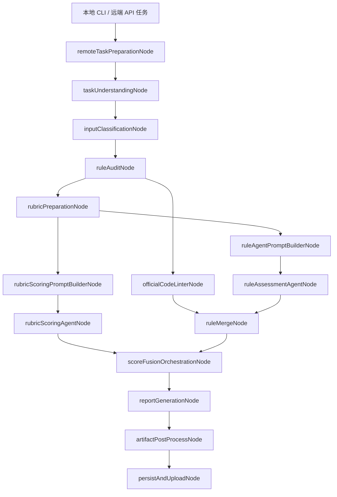
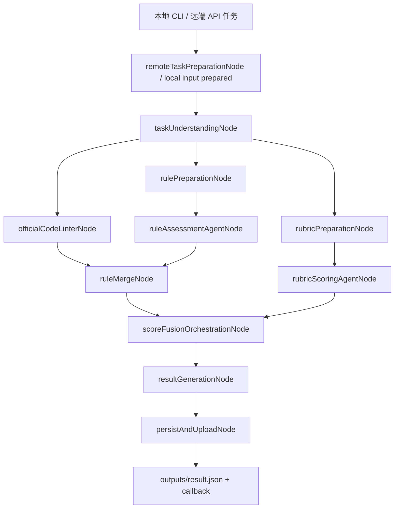
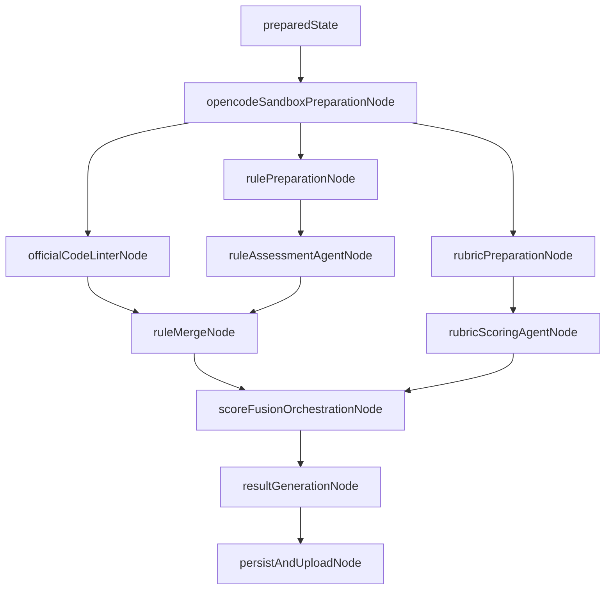

# LangGraph 节点重排重构 Spec

## 背景

当前主评分 workflow 定义在 `src/workflow/graph/scoreWorkflow.ts`。现有链路为：



这个拓扑有几个问题：

- `inputClassificationNode` 只是读取已有 `state.taskType` 或做 fallback 推断。远端任务类型已经由接口 payload 携带，本地任务也应在入口阶段确定，不需要独立 LangGraph 节点。
- `officialCodeLinterNode`、规则分支和 rubric 分支没有真正并行。当前 `officialCodeLinterNode` 与 `rubricPreparationNode` 都挂在 `ruleAuditNode` 后面，实际必须等待规则审计完成。
- `ruleAgentPromptBuilderNode` 与 `rubricScoringPromptBuilderNode` 是薄包装节点，主要把 preparation 结果转成 agent payload，增加了 graph 噪音。
- `artifactPostProcessNode` 只负责生成 `report.html`。新目标是不再生成 HTML 报告，评分结果以 `outputs/result.json` 为唯一正式输出。
- `ruleMergeNode` 目前只是把确定性规则、官方 linter 规则和 agent 判定拼接/回退，下游扣分仍依赖不同规则来源的隐式口径，需要在合并阶段拉齐规则影响表达。

同时，`taskUnderstandingNode` 必须保留。它不是任务类型判定节点，而是共同前置的任务理解节点：构建 opencode sandbox、生成 effective patch、汇总原始输入和工程结构，输出 `ConstraintSummary`。rule agent 与 rubric agent 的 payload 都通过 `task_understanding` 字段消费这份摘要，用它替代完整 PRD/原始 prompt 的长输入。

## 目标

1. 保留 `taskUnderstandingNode` 作为 rule 与 rubric 的共同前置节点。
2. 去掉 `inputClassificationNode`，任务类型只来自入口 payload 或入口标准化阶段。
3. 让 `officialCodeLinterNode`、规则分支、rubric 分支在 `taskUnderstandingNode` 后并行启动。
4. 将 rule 与 rubric 的 prompt builder 合并进各自 preparation 节点，减少显式 LangGraph 节点。
5. 在 `ruleMergeNode` 拉齐不同规则来源的扣分/封顶/硬门槛表达。
6. 删除 `artifactPostProcessNode`，停止生成和写入 `outputs/report.html`。
7. 更新服务恢复流程、观测标签、schema、测试与架构文档，保证拓扑和产物语义一致。

## 非目标

- 不改 opencode agent 的模型调用协议。
- 不改 `task_understanding` 对外字段名。内部类型仍可继续使用 `ConstraintSummary`，payload 中继续序列化为 `task_understanding`。
- 不重写 rubric 评分算法，只调整它接收的前置节点和 payload 构建位置。
- 不重写官方 Code Linter runner、parser、mapper，只解除它对 `ruleAuditNode` 的时序依赖。
- 不删除 `src/report/html/` 代码作为本次必须项；第一阶段只从 workflow 和产物中移除 HTML 生成。后续可单独清理未引用模块。

## 目标拓扑

### 普通评分入口



### 已接收远端任务恢复入口

`runPreparedScoreWorkflow` 的 prepared state 已包含 `caseInput`、`effectivePatchPath`、`caseRuleDefinitions`、`constraintSummary`、`taskType` 等字段。恢复执行时只需要保证 sandbox 可用，然后进入三路并行：



## 节点设计

### `remoteTaskPreparationNode`

保留现有职责：

- 下载远端原始工程和生成工程。
- 物化标准 case 目录。
- 读取远端 payload 中的任务类型，调用 `resolveRemoteTaskType(remoteTask.testCase.type)` 写入 `state.taskType`。
- 写入 `caseInput`、`sourceCasePath`、`remoteTaskRootDir`、`inputMode`、文件数、`remoteBuildSuccess`。

约束：

- 不做任务类型推断。
- 远端 payload 类型不合法时直接失败，不再进入后续 graph。

本地 CLI 入口也应在调用 graph 前明确写入 `taskType`。如需兼容旧本地用例，可以把 `inferTaskTypeFromCaseInput` 保留为入口层 fallback，但不再作为 LangGraph 节点出现。

### `taskUnderstandingNode`

保留，并作为 rule 与 rubric 的共同前置。

现有职责继续保留：

- 收集原始/生成工程结构。
- 生成或过滤 `effective.patch`。
- 读取 patch summary。
- 加载 case constraint rules。
- 构建 opencode sandbox。
- 调用 `hmos-understanding` 输出 `ConstraintSummary`。
- 持久化 `intermediate/constraint-summary.json` 和 `intermediate/case-rule-definitions.json`。

语义调整：

- 不再承担任务类型 fallback 推断。节点应要求 `state.taskType` 已存在；缺失时抛出明确错误。
- `ConstraintSummary` 继续作为内部类型名，但对 agent payload 的字段名保持 `task_understanding`。
- `caseInput.promptText` 可以继续作为任务理解 agent 的输入；rule/rubric agent 后续只消费压缩后的 `task_understanding`，避免重复传完整 PRD。

### `officialCodeLinterNode`

从 `taskUnderstandingNode` 后直接启动，与规则/rubric 分支并行。

当前阻塞点是它读取 `state.evidenceSummary?.changedFiles` 和 `changedLineNumbersByFile`，而这些字段来自 `ruleAuditNode` 内部的 `collectEvidence`。为解除依赖，官方 linter 节点需要自己准备 patch 范围信息。

方案：

- 在 `rules/evidence` 中拆出轻量 helper，例如 `collectPatchEvidenceSummary(caseInput)` 或 `collectChangedFileScope(caseInput)`。
- `officialCodeLinterNode` 内部调用该 helper，获得：
  - `changedFiles`
  - `changedLineNumbersByFile`
  - `hasPatch`
- hvigor build check 和 linter finding 过滤继续使用这些字段。
- `constraintSummary.crossDeviceAdaptation` 仍来自 `taskUnderstandingNode`，用于选择 cross-device linter rule sets。

输出保持：

- `officialLinterRunStatus`
- `officialLinterSummary`
- `officialLinterFindings`
- `officialLinterRuleResults`
- `hvigorBuildCheckStatus`
- `hvigorBuildCheckSummary`

### `rulePreparationNode`

新增节点，替代显式的 `ruleAuditNode + ruleAgentPromptBuilderNode` 链。

职责：

- 读取 `state.constraintSummary.crossDeviceAdaptation`，通过 `resolveEnabledRulePackIds` 确定启用规则包。
- 调用 `runRuleEngine`，输出静态规则结果、确定性规则结果、agent 候选、证据索引、rule violations、evidence summary。
- 构建 `ruleAgentBootstrapPayload`，字段中包含：
  - `case_context`
  - `task_understanding: state.constraintSummary`
  - `rubric_summary`
  - `assisted_rule_candidates`

注意：当前 `buildAgentBootstrapPayload` 需要 `rubricSnapshot`，而 `rulePreparationNode` 与 `rubricPreparationNode` 目标上需要并行。这里有两种实现选择：

1. 推荐：让 `rulePreparationNode` 自己加载轻量 rubric snapshot。这样 rule/rubric 两条分支无依赖，代价是 rubric 文件读取重复一次。
2. 备选：把 rule agent payload 中的 `rubric_summary` 改为可选或仅保留 rule 判定必要字段。代价是要同步调整 agent prompt 契约与测试。

建议采用方案 1。rubric 文件读取成本低，换来拓扑简单和并行确定性。

输出字段：

- `staticRuleAuditResults`
- `deterministicRuleResults`
- `enabledRulePacks`
- `assistedRuleCandidates`
- `ruleEvidenceIndex`
- `ruleViolations`
- `evidenceSummary`
- `ruleAgentBootstrapPayload`

命名迁移：

- 可保留 `ruleAuditNode` 作为内部函数或兼容导出，但 graph 节点名建议使用 `rulePreparationNode`。
- 观测文案使用“规则准备”，摘要包含 `rules / violations / candidates / deterministic`。

### `ruleAssessmentAgentNode`

保留现有职责：

- 消费 `ruleAgentBootstrapPayload`。
- 没有 candidates 时返回 skipped。
- 调用 `hmos-rule-assessment`。
- 写入 `ruleAgentRunnerResult`、`ruleAgentRunStatus`、`ruleAgentAssessmentResult` 等状态。

约束：

- 官方 linter 结果不能进入 rule agent prompt。它只在 `ruleMergeNode` 合并，保留当前 `rule-agent-linter-boundary` 的边界要求。

### `rubricPreparationNode`

保留并扩展，替代显式的 `rubricScoringPromptBuilderNode`。

职责：

- 加载 `state.taskType` 对应 rubric。
- 加载 risk taxonomy。
- 构建 `rubricSnapshot`。
- 构建 `rubricScoringPayload`，字段中包含：
  - `case_context`
  - `task_understanding: state.constraintSummary`
  - `rubric_summary`
  - `workspace_project_structure`
  - `response_contract`

输出字段：

- `rubricSnapshot`
- `rubricScoringPayload`

这样 `rubricPreparationNode -> rubricScoringAgentNode` 成为完整 rubric 分支。

### `rubricScoringAgentNode`

保留现有职责：

- 消费 `rubricScoringPayload`。
- 调用 `hmos-rubric-scoring`。
- 写入 `rubricScoringResult`、`rubricAgentRunStatus`、`rubricAgentRunnerResult`、raw text 等状态。

### `ruleMergeNode`

保留并增强为规则影响归一化边界。

输入：

- `deterministicRuleResults`
- `assistedRuleCandidates`
- `ruleAgentRunnerResult`
- `officialLinterRuleResults`
- `caseRuleDefinitions`
- `staticRuleAuditResults`

合并顺序：

1. 静态确定性规则。
2. rule agent 对 assisted candidates 的判定或 fallback。
3. 官方 Code Linter 映射规则。
4. case constraint rule 结果。

扣分对齐：

在 `ruleMergeNode` 内新增统一规则影响结构，建议类型为：

```ts
type NormalizedRuleImpact = {
  rule_id: string;
  rule_source: "must_rule" | "should_rule" | "forbidden_pattern";
  origin: "static" | "rule_agent" | "official_linter" | "case_constraint";
  result: "满足" | "不满足" | "不涉及" | "待人工复核";
  conclusion: string;
  severity?: "critical" | "major" | "minor" | "info";
  score_effect: {
    mode: "none" | "deduct" | "cap" | "hard_gate" | "review_only";
    points?: number;
    cap?: number;
    reason: string;
  };
  evidence?: Array<Record<string, unknown>>;
};
```

兼容策略：

- `mergedRuleAuditResults` 继续输出 `RuleAuditResult[]`，避免一次性改穿所有下游。
- 新增 `normalizedRuleImpacts` 或把 `score_effect` 增量挂到扩展后的 `RuleAuditResult`。推荐新增字段，降低对旧接口的破坏。
- `scoreFusionOrchestrationNode` 优先消费 `normalizedRuleImpacts`；缺失时继续基于 `mergedRuleAuditResults` fallback。

扣分口径来源：

- 静态规则与 case rule：根据 `rule_source`、priority、risk taxonomy 映射到 hard gate / cap / deduct。
- 官方 linter：根据 `official_linter_severity` 和 rule profile 映射 severity，再映射 score effect。
- agent 判定：先归一成 `RuleAuditResult`，再按候选规则元数据映射 score effect。

### `scoreFusionOrchestrationNode`

保留。

调整：

- 输入等待 `ruleMergeNode` 与 `rubricScoringAgentNode`。
- 优先使用 `normalizedRuleImpacts` 进行规则扣分、封顶和硬门槛计算。
- `evidenceSummary` 仍来自 `rulePreparationNode`；如果规则分支失败，保持当前 fallback。
- `hvigorBuildCheckSummary` 继续由官方 linter 分支写入，并参与硬门槛。

### `resultGenerationNode`

建议将 `reportGenerationNode` 改名为 `resultGenerationNode`。

职责：

- 生成并校验 `resultJson`。
- 不生成 HTML。
- `report_meta` 改为结果元数据，建议字段为：
  - `result_json_file_name`
  - `unit_name`
  - `generated_at`

schema 影响：

- `references/scoring/report_result_schema.json` 中 `report_meta.report_file_name` 不再 required。
- `tests/fixtures/report_result_schema.json` 同步更新。
- 如果短期需要兼容历史消费者，可保留 `report_file_name: null`，但当前 schema 只允许 string，不推荐。更干净的做法是移除字段并更新 schema。

### `artifactPostProcessNode`

删除出 graph。

处理范围：

- 删除 `src/workflow/nodes/artifactPostProcess` 的导出与引用。
- 删除 graph edge：`resultGenerationNode -> artifactPostProcessNode -> persistAndUploadNode`。
- 新 edge：`resultGenerationNode -> persistAndUploadNode`。
- HTML renderer 测试可以删除或迁移为独立非 workflow 测试，取决于是否保留 `src/report/html` 作为开发辅助。

### `persistAndUploadNode`

保留并简化。

继续写入：

- `inputs/rubric-scoring-payload.json`
- `inputs/rule-agent-bootstrap-payload.json`
- `intermediate/constraint-summary.json`
- `intermediate/case-rule-definitions.json`
- `intermediate/rule-audit.json`
- `intermediate/rule-audit-merged.json`
- `intermediate/score-fusion.json`
- `intermediate/rubric-agent-result.json`
- `intermediate/rule-agent-result.json`
- `outputs/result.json`

停止写入：

- `outputs/report.html`

返回值：

- 返回 `{ resultJson }`。
- 移除 `htmlReport`。

## State 迁移

`ScoreState` 调整：

- 删除 `htmlReport`。
- 删除仅服务于独立 prompt builder 的中间节点依赖，但保留 payload 字段：
  - `rubricScoringPayload` 保留。
  - `ruleAgentBootstrapPayload` 保留。
- 新增可选字段：
  - `normalizedRuleImpacts`，用于 rule merge 到 score fusion 的统一扣分表达。

`PreparedWorkflowInput.preparedState` 保持至少包含：

- `caseInput`
- `sourceCasePath`
- `remoteTaskRootDir`
- `inputMode`
- `originalFileCount`
- `workspaceFileCount`
- `hasPatch`
- `remoteBuildSuccess`
- `caseDir`
- `effectivePatchPath`
- `caseRuleDefinitions`
- `constraintSummary`
- `taskType`

## 服务层影响

`src/service/index.ts` 当前在接收远端任务时执行：

```text
remoteTaskPreparationNode -> taskUnderstandingNode -> inputClassificationNode
```

调整为：

```text
remoteTaskPreparationNode -> taskUnderstandingNode
```

具体改动：

- 移除 `inputClassificationNode` import。
- `prepareAcceptedRemoteEvaluationTask` 不再调用 `inputClassificationNode`。
- 日志从“任务类型读取完成”改为“任务理解完成 taskType=...”。
- `toAcceptedRemoteWorkflowState` 继续要求 `taskType` 存在，确保任务类型来自 `remoteTaskPreparationNode` 或入口 state。

## 观测与文档影响

更新文件：

- `src/workflow/observability/types.ts`
  - 删除 `inputClassificationNode`、`rubricScoringPromptBuilderNode`、`ruleAgentPromptBuilderNode`、`artifactPostProcessNode`。
  - 新增 `rulePreparationNode`，可新增 `resultGenerationNode`。
- `src/workflow/observability/nodeLabels.ts`
  - 新增“规则准备”“结果生成”。
  - 删除“任务分类”“产物后处理”等标签。
- `src/workflow/observability/nodeSummaries.ts`
  - `taskUnderstandingNode` 摘要保持约束数量。
  - `rulePreparationNode` 摘要展示 rules、violations、deterministic、candidates。
  - `rubricPreparationNode` 摘要展示 dimensions、hardGates，并可加 payloadReady。
  - `resultGenerationNode` 摘要只展示 resultReady。
  - `persistAndUploadNode` 摘要只展示 outputsWritten。
- `docs/ARCHITECTURE.md`
  - 更新 Mermaid 图、节点表、运行产物目录。
  - 最终产物从 `result.json + report.html + callback` 改为 `result.json + callback`。

## 测试计划

### 单元测试

- `taskUnderstandingNode`
  - 缺失 `taskType` 时失败。
  - 正常输出 `constraintSummary`，rule/rubric payload 中仍表现为 `task_understanding`。
- `officialCodeLinterNode`
  - 不依赖 `state.evidenceSummary` 时也能基于 patch scope 运行 hvigor 和 filtering。
  - cross-device rule set 仍由 `constraintSummary.crossDeviceAdaptation` 决定。
- `rulePreparationNode`
  - 输出原 `ruleAuditNode` 的规则审计字段。
  - 同时输出 `ruleAgentBootstrapPayload`。
  - payload 不包含 `officialLinterRuleResults`。
- `rubricPreparationNode`
  - 输出 `rubricSnapshot` 和 `rubricScoringPayload`。
- `ruleMergeNode`
  - 合并 deterministic、agent、official linter、case rule。
  - 输出统一 `normalizedRuleImpacts`。
  - agent 不可用时仍稳定 fallback。
- `persistAndUploadNode`
  - 写入 `outputs/result.json`。
  - 不写入 `outputs/report.html`。

### Workflow 测试

- 普通 graph 拓扑：
  - `taskUnderstandingNode` 后三路分支可并行启动。
  - `scoreFusionOrchestrationNode` 等待 `ruleMergeNode` 与 `rubricScoringAgentNode`。
- prepared graph 拓扑：
  - `opencodeSandboxPreparationNode` 后三路分支可并行启动。
- 远端异步接收：
  - `prepareRemoteEvaluationTask` 不再调用 `inputClassificationNode`。
  - accepted state 仍包含 `taskType`、`constraintSummary`、`effectivePatchPath`。

### Schema 与产物测试

- `reportGenerationNode/resultGenerationNode` 输出通过新版 schema。
- `report_meta` 不再要求 `report_file_name`。
- local CLI 与远端任务完成后只有 `outputs/result.json` 是正式输出。
- dashboard、raw result、human review 继续读取 `outputs/result.json`，不依赖 HTML。

### 建议验证命令

```bash
npm run build
node --import tsx --test tests/official-code-linter-node.test.ts
node --import tsx --test tests/score-agent.test.ts
node --import tsx --test tests/remote-network-execution.test.ts
node --import tsx --test tests/workflow-node-summary.test.ts tests/workflow-event-logger.test.ts
npm test
```

## 分阶段实施建议

### 阶段 1：删除任务分类节点

- 从 graph 普通入口删除 `inputClassificationNode`。
- 从服务层接收流程删除 `inputClassificationNode`。
- 让 `taskUnderstandingNode` 要求 `state.taskType` 必填。
- 更新 observability 与测试。

### 阶段 2：合并 rule/rubric prompt builder

- 创建 `rulePreparationNode`，合并 `ruleAuditNode` 与 `ruleAgentPromptBuilderNode` 职责。
- 扩展 `rubricPreparationNode`，合并 `rubricScoringPromptBuilderNode` 职责。
- 保留旧节点导出一小段时间可选，但 graph 不再使用。

### 阶段 3：真正并行三分支

- 拆出 patch/evidence scope helper。
- 改造 `officialCodeLinterNode`，不再依赖 `state.evidenceSummary`。
- 更新普通与 prepared graph edges。

### 阶段 4：规则影响归一化

- 在 `ruleMergeNode` 输出 `normalizedRuleImpacts`。
- 改造 `scoreFusionOrchestrationNode` 优先消费统一规则影响。
- 补齐不同规则来源的扣分对齐测试。

### 阶段 5：移除 HTML 后处理

- 删除 graph 中的 `artifactPostProcessNode`。
- `persistAndUploadNode` 停止写入 `outputs/report.html`。
- 更新 result schema、fixtures、测试和 `docs/ARCHITECTURE.md`。

## 风险与缓解

- 风险：`officialCodeLinterNode` 与 `rulePreparationNode` 分别收集 patch scope，结果不一致。
  - 缓解：共用 `rules/evidence` 下的同一个 helper，并用测试固定 changedFiles 与 changedLineNumbersByFile。
- 风险：rule preparation 自行加载 rubric snapshot 导致与 rubric 分支不一致。
  - 缓解：共用 `loadRubricForTaskType + buildRubricSnapshot`，并在测试中断言同 taskType 下 snapshot task_type 一致。
- 风险：删除 `report_file_name` 影响历史消费者。
  - 缓解：API 文档明确正式产物只有 `result.json`；dashboard 和 raw result 本身已基于 result.json。
- 风险：节点重命名影响 workflow 日志和测试。
  - 缓解：一次性更新 `WorkflowNodeId`、labels、summaries；必要时在日志解释层保留旧节点名兼容历史记录，但新执行不再产生旧节点。

## 验收标准

- 主评分 workflow 中不再出现 `inputClassificationNode`、`rubricScoringPromptBuilderNode`、`ruleAgentPromptBuilderNode`、`artifactPostProcessNode`。
- `taskUnderstandingNode` 仍在 rule/rubric 前共同执行，rule/rubric agent payload 均包含 `task_understanding`。
- `officialCodeLinterNode`、`rulePreparationNode`、`rubricPreparationNode` 从同一个前置节点后并行启动。
- `ruleMergeNode` 输出统一规则影响，score fusion 对不同规则来源采用一致扣分口径。
- 完成评分后写入 `outputs/result.json`，不再写入 `outputs/report.html`。
- `npm run build` 与核心 workflow、remote、linter、schema、observability 测试通过。
