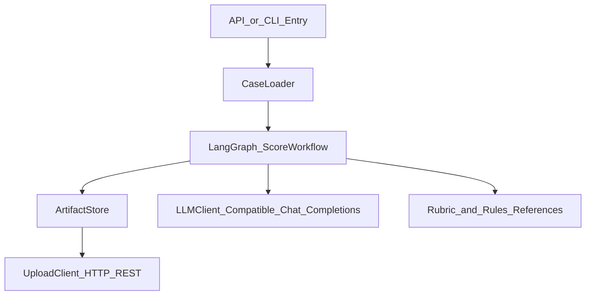
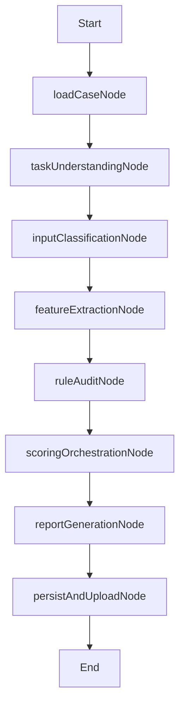

# HarmonyOS 代码评分服务设计文档（LangGraph TS）

## 1. 背景与目标

本服务用于对“由代码生成 Agent 产出的 HarmonyOS 工程”进行工程质量评分。  
评分目标是结构化、可追溯、可落盘、可上传，支持本地运行与云端独立部署。

核心能力：
- 基于 LangGraph 编排评分流程节点。
- 按 `full_generation` / `continuation` / `bug_fix` 分类选择 rubric。
- 全量执行静态规则审计并输出逐条结论。
- 输出固定 schema 的 `result.json` 与可视化 `report.html`。

## 2. 输入输出定义

### 2.1 单用例输入（Case）

每个用例包含以下信息（本地路径或网络 URL）：
- 原始工程（before）
- 提供给代码生成 AI 的输入（prompt）
- 生成后完整工程（after）
- 前后差异 patch（可选但推荐）

与 `init-input` 对齐时，先走本地目录加载；后续接入下载接口。

### 2.2 输出产物

- `constraint-summary.json`：任务理解结论
- `feature-extraction.json`：代码特征提取结果
- `rule-audit.json`：规则逐条审计台账
- `result.json`：固定 schema 评分结果（按 `report_result_schema.json`）
- `report.html`：可视化报告

`result.json` 需上传云端管理台；`report.html` 当前仅本地落盘（保留上传扩展）。

## 3. 总体架构

组件说明：
- `CaseLoader`：解析本地/远程用例输入，构造成统一 `CaseInput`。
- `LangGraph ScoreWorkflow`：串联任务理解、分类、特征、规则、评分、报告节点。
- `ArtifactStore`：负责本地用例目录落盘。
- `UploadClient`：上传 `result.json`（HTTP REST 适配）。
- `LLMClient`：调用兼容 chat completions 的模型服务完成评分 Agent 交互。
- `ReferenceRepo`：读取 rubric/rules/schema 参考文件。

## 4. Workflow 设计

### 节点职责

1. `loadCaseNode`  
   - 加载 prompt / before / after / patch 及元数据。
   - 标准化为内部状态对象，记录 caseId 与执行目录。

2. `taskUnderstandingNode`  
   - 显式约束：从 prompt 提取任务类型/行业/场景/目标。
   - 上下文约束：从原始工程结构提取模块与实现约束。
   - 隐式约束：从 patch 提取修改范围、侵入程度、改动类型。
   - 结果落盘 `constraint-summary.json`。

3. `inputClassificationNode`  
   - 基于约束结论与输入形态判定 `task_type`。
   - 选择对应 rubric 参考（full_generation/continuation/bug_fix）。

4. `featureExtractionNode`  
   - 基础特征：状态管理、路由、关键配置。
   - 结构特征：目录分层、模块边界、职责划分。
   - 语义特征：命名质量、领域关键词一致性。
   - 变更特征：最小改动、无关侵入、风险扩散。
   - 结果落盘 `feature-extraction.json`。

5. `ruleAuditNode`  
   - 全量遍历 `src/rules/packs/` 下注册的规则包。
   - 每条规则输出 `满足/不满足/不涉及` + 一句话结论。
   - 汇总违规摘要（rule_violations）并落盘 `rule-audit.json`。

6. `scoringOrchestrationNode`  
   - 按 rubric 维度和指标加权评分。
   - 识别硬门槛并应用总分上限。
   - 汇总风险、人工复核项、优势与问题项。

7. `reportGenerationNode`  
   - 严格按 schema 生成 `result.json`。
   - 生成 `report.html` 供人工浏览。

8. `persistAndUploadNode`  
   - 将全部中间产物落盘至用例目录。
   - 调用 HTTP REST 上传 `result.json`。

## 5. 状态模型（LangGraph State）

建议核心状态字段：
- `caseInfo`：caseId、输入来源、本地工作目录
- `inputs`：before/prompt/after/patch 内容与索引
- `constraints`：任务理解结论
- `taskType`：三分类结果及依据
- `features`：特征提取输出
- `ruleAuditResults`：逐条规则审计台账
- `ruleViolations`：违规摘要
- `scoring`：维度分、子指标分、硬门槛状态、总分
- `reportArtifacts`：resultJson、htmlReport、上传回执
- `errors`：流程异常与降级信息

## 6. 配置与可扩展设计

### 6.1 配置分层

- `app`：运行环境、本地输出根目录、日志级别
- `llm`：model、baseURL、apiKey、timeout、retries
- `io`：download/upload endpoint、鉴权、重试策略
- `evaluation`：规则开关、构建检查开关、置信度策略

### 6.2 可配置任务理解

新增 `constraints.extractors.yaml`（建议）：
- 配置 prompt 约束提取规则
- 配置工程上下文扫描模式
- 配置 patch 隐式约束判定规则

目标是“新增约束类型不改主流程代码”。

### 6.3 扩展点

- 下载适配器：HTTP、对象存储、内部文件网关
- 上传适配器：REST、S3 兼容接口
- 特征提取插件：第三方库、性能、复杂度等
- 评分模型切换：不同供应商或本地模型

## 7. 本地落盘与云端上传策略

### 7.1 本地目录规范

每条用例独立目录：
- `./.local-cases/<caseId>/`（加入 `.gitignore`）

目录示例：
- `inputs/`：标准化后的输入快照
- `intermediate/`：constraint、feature、rule-audit
- `outputs/`：result.json、report.html
- `logs/`：流程日志与错误记录

### 7.2 上传策略

- 上传对象：`result.json`
- 上传时机：workflow 成功后；失败时可上报失败状态（后续增强）
- 上传协议：HTTP REST（POST）
- 返回内容：任务回执 ID、接收时间、状态

## 8. 接口设计（首版）

### 8.1 CLI

- `npm run score -- --case <path-or-case-id>`
- `npm run score -- --case <path> --upload`
- `npm run score -- --case <path> --dry-run`

### 8.2 HTTP API

- `POST /score/run`
  - 请求体：case 描述（本地/远程输入引用）
  - 返回：执行 ID、当前状态、产物路径（或查询链接）

- `GET /score/result/:executionId`
  - 返回：执行状态、result.json 概览、错误信息

## 9. 错误处理与降级

- 输入不完整：标记 `human_review_items` 并降低 `confidence`。
- patch 缺失：切换目录 diff 兜底并记录不确定性。
- LLM 失败：重试 + 降级模板判定，保留失败证据。
- 上传失败：本地结果保留，返回可重试标志与失败原因。

## 10. 安全与运维建议

- 通过环境变量注入 API Key，不写入仓库。
- 对上传接口启用鉴权与超时重试。
- 记录关键审计日志：输入摘要、规则判定、分数计算链路。
- 服务无状态化，便于容器部署与水平扩展。

## 11. 里程碑

1. 完成骨架：LangGraph workflow + CLI 可跑通。
2. 接入规则与 rubric：输出 schema 合法 `result.json`。
3. 完成本地产物落盘与 HTML 报告。
4. 接入 REST 上传并打通端到端。
5. 用 `init-input` 完成验证样例。

## 12. 验收标准

- 可对单用例完成全链路评分并成功输出 `result.json` + `report.html`。
- `result.json` 严格符合目标 schema。
- 规则审计覆盖 `src/rules/packs/` 中注册规则的全量条目。
- 支持本地路径输入，保留远程下载接口。
- 上传接口可配置并可独立开关。
